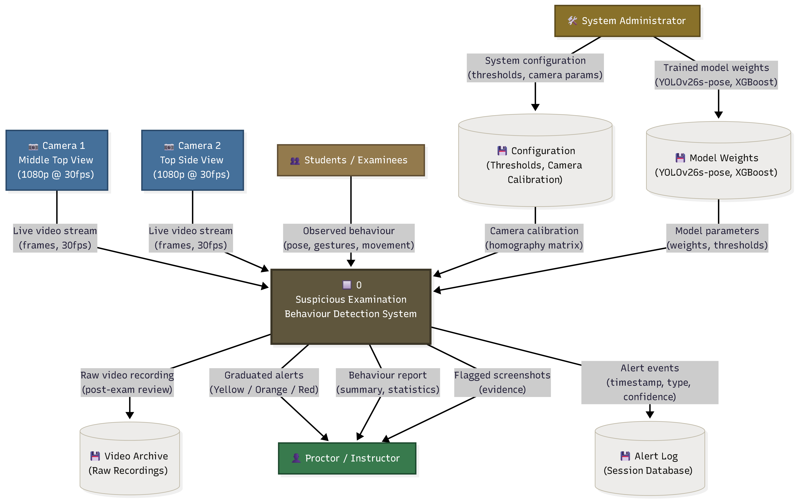
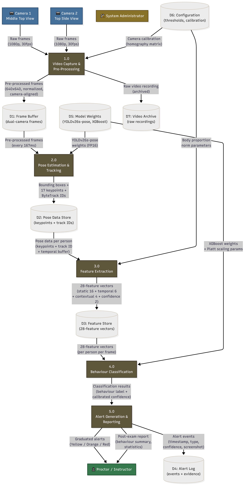
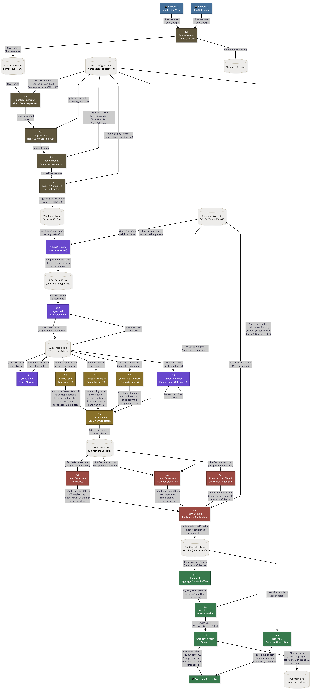

# Data Flow Diagram (DFD) Specifications & Stage Descriptions

## Project Information
- **Project Title:** Detection of Suspicious Examination Behaviours Using Human Pose Estimation and Deep Learning
- **Institution:** DMMMSU - South La Union Campus | BS Computer Science (AY 2025-2026)
- **Deployment Platform:** Desktop Application (PyQt6 with GPU-accelerated PyTorch/CUDA backend)
- **Inference Specification:** 3 FPS inference rate (333 ms sample window), 60-frame state buffer (20-second temporal memory), sub-50ms processing latency per frame pipeline.

---

# Overview of Data Flow Diagram Architecture

The Data Flow Diagrams (DFDs) model the flow of data through the AI-assisted examination surveillance system, depicting how raw multi-angle video feeds are captured, pre-processed, analyzed for human poses, feature-engineered, classified into suspicious behavioral patterns, and transformed into real-time proctoring alerts and post-exam audit reports.

The DFD specification is structured into three progressive abstraction stages:
1. **Stage 0 — Context Diagram (Level 0 DFD):** Defines the overall system scope, external entities, high-level inputs/outputs, and data store interactions.
2. **Stage 1 — Major System Processes (Level 1 DFD):** Decomposes the single system process into 5 core operational modules and maps primary data pipelines between data stores.
3. **Stage 2 — Sub-Processes & Functional Decomposition (Level 2 DFD):** Breaks down each Level 1 process into 21 granular sub-processes, detailing algorithmic transformations, heuristic thresholds, machine learning models, and temporal buffers.

---

# Stage 0 — Context Diagram (Level 0 DFD) Description

### Purpose & Scope
Stage 0 represents the system as a single central process (**Process 0: Suspicious Examination Behaviour Detection System**) surrounded by its external environment. It establishes the operational boundary, identifying all external data sources (sensors and human actors), data sinks, and persistent data repositories without exposing internal algorithmic complexity.

### External Entities
1. **Camera 1 (Middle Top View):** Overhead primary video capture device delivering 1080p RGB video streams at 30 fps covering the full classroom row layout.
2. **Camera 2 (Top Side View):** Secondary angular video capture device delivering complementary 1080p RGB streams at 30 fps to eliminate body/desk occlusions.
3. **Students / Examinees:** Human subjects whose physical posture, head position, facial orientation, and hand movements generate spatial-temporal pose observations.
4. **Proctor / Instructor:** Primary human recipient of surveillance outputs. Receives real-time visual alerts, audio notifications, evidence snapshots, and post-exam analytical summaries.
5. **System Administrator:** System manager responsible for configuring spatial homography calibration, setting alert sensitivity thresholds, and uploading updated model weights.

### Primary System Inputs & Outputs
- **Inflows to System:**
  - Live dual-camera video feeds (1080p @ 30 fps).
  - Admin configurations (camera calibration matrix, Platt scaling parameters, alert confidence thresholds).
  - Pre-trained neural model weights (YOLOv26s-pose, ArcFace antelopev2 embeddings, XGBoost classifier models).
- **Outflows from System:**
  - Real-time graduated alerts (Yellow / Orange / Red tiers) dispatched to the PyQt6 proctor UI.
  - Evidence capture artifacts (timestamped bounding-box screenshots of flagged events).
  - Session database logs (recorded incidents, student IDs, behavior types, confidence scores).
  - Post-examination summary reports (statistical breakdown of exam integrity and student timeline metrics).
  - Archived raw video recordings for offline compliance review.

---

# Stage 1 — Major System Processes (Level 1 DFD) Description

### Overview & Process Decomposition
Stage 1 expands Process 0 into five foundational operational processes (**1.0 through 5.0**). This level details how raw video frames propagate through sequential pipeline stages, storing intermediate representations in 7 primary data stores.

### Detailed Process Descriptions

#### Process 1.0: Video Capture & Pre-Processing
- **Functional Description:** Ingests synchronized dual 1080p video streams at 30 fps. Executes image quality checks (blur filtering, overexposure detection), removes near-duplicate frames via perceptual hashing, resizes and letterboxes frames to $640 \times 640$ tensor inputs, normalizes pixel intensity, and applies homography calibration matrices for camera spatial alignment.
- **Inputs:** Dual-camera raw video feeds (Cam 1 & Cam 2), configuration parameters from **D6 Configuration**.
- **Outputs:** Pre-processed, normalized frame buffers written to **D1 Frame Buffer**; raw video streams archived in **D7 Video Archive**.

#### Process 2.0: Pose Estimation & Tracking
- **Functional Description:** Retrieves pre-processed frames every 333 ms (3 FPS inference frequency). Runs half-precision (FP16) YOLOv26s-pose model inference to detect human bounding boxes and 17 COCO-format anatomical keypoints. Executes ByteTrack motion-association to assign persistent track IDs across frames and handles occlusion. Performs ArcFace facial embedding matching every 10 seconds to verify student identities and detect unauthorized seat swaps. Merges dual-camera tracks into a unified 3D spatial coordinate representation.
- **Inputs:** Clean frame tensors from **D1 Frame Buffer**, YOLOv26s-pose and ArcFace model weights from **D5 Model Weights**.
- **Outputs:** 17 body keypoint coordinates, tracking IDs, face identity associations, and spatial coordinates written to **D2 Pose Data Store**.

#### Process 3.0: Feature Extraction
- **Functional Description:** Transforms raw keypoint coordinates and historical track trajectories into an unpadded 28-element feature vector normalized by body proportions (e.g., torso length and inter-shoulder distance). Computes static posture angles, dynamic temporal velocities/accelerations over a 60-frame buffer (20s history), contextual spatial interactions with neighboring examinees, and keypoint detection confidence metrics.
- **Inputs:** Multi-frame keypoint history from **D2 Pose Data Store**, normalization parameters from **D6 Configuration**.
- **Outputs:** Standardized 28-feature vectors per examinee per frame committed to **D3 Feature Store**.

#### Process 4.0: Behaviour Classification
- **Functional Description:** Implements a hybrid classification engine. Head-based suspicious behaviors (*side glancing, head down, standing*) are evaluated via deterministic geometric rules. Hand-based behaviors (*passing notes, hand signaling*) are evaluated using a trained XGBoost gradient-boosted decision tree. Unauthorized object usage is evaluated via contextual hand-desk spatial interaction rules. Raw classifier logits are transformed into calibrated probability estimates using Platt scaling ($A \cdot f + B$).
- **Inputs:** 28-feature vectors from **D3 Feature Store**, XGBoost model parameters and Platt scaling coefficients from **D5 Model Weights**.
- **Outputs:** Discrete behavior class labels and calibrated confidence scores ($[0.0, 1.0]$) stored in **D4 Alert Log / Classification Store**.

#### Process 5.0: Alert Generation & Reporting
- **Functional Description:** Aggregates classification outputs across a 3-second sliding window buffer to maintain temporal consensus and eliminate false-positive spikes. Compares consensus probabilities against graduated thresholds to trigger 3 distinct alert tiers: **Yellow** (log-only minor anomaly), **Orange** (proctor sidebar visual toast), and **Red** (critical violation with screen flash, audio chime, and evidence screenshot capture). Synthesizes session metrics into post-examination analytical audit reports.
- **Inputs:** Calibrated classification results, alert threshold settings from **D6 Configuration**.
- **Outputs:** Graduated real-time alert notifications dispatched to Proctor UI; recorded incident records written to **D4 Alert Log**.

---

# Stage 2 — Sub-Processes & Functional Decomposition (Level 2 DFD) Description

Stage 2 provides the most detailed functional breakdown, partitioning the 5 Level 1 processes into 21 specialized sub-processes (**1.1 through 5.4**).

### Detailed Sub-Process Specifications

---

## 1.0 Video Capture & Pre-Processing Sub-Processes

#### Sub-Process 1.1: Dual-Camera Frame Capture
- **Function:** Instantiates multi-threaded OpenCV capture loops bound to RTSP/USB video interfaces for Camera 1 (Overhead) and Camera 2 (Side-angle) at 1080p @ 30 fps.
- **Input:** Hardware video stream signals.
- **Output:** Raw RGB frame matrices written to **D1a Raw Frame Buffer**.

#### Sub-Process 1.2: Quality Filtering (Blur & Overexposure)
- **Function:** Calculates image blur using Laplacian variance ($\sigma^2 < 50$ flagged as blurry) and detects overexposure (pixel intensity $> 245$ over $>80\%$ image area). Rejects degraded frames.
- **Input:** Raw frames from **D1a Raw Frame Buffer**, quality thresholds from **D7 Configuration**.
- **Output:** Quality-verified image frames.

#### Sub-Process 1.3: Duplicate & Near-Duplicate Removal
- **Function:** Computes 64-bit perceptual hashes (pHash) on incoming frames. Drops consecutive frames exhibiting Hamming distance $< 5$ to minimize redundant GPU processing.
- **Input:** Verified image frames.
- **Output:** Filtered unique image frame stream.

#### Sub-Process 1.4: Resolution & Colour Normalization
- **Function:** Resizes frames to $640 \times 640$ via letterbox padding (filling border pixels with RGB 128,128,128), converts color spaces (RGB to BGR tensor format), and scales pixel values to $[0.0, 1.0]$.
- **Input:** Unique image frame stream.
- **Output:** Tensor-formatted image inputs.

#### Sub-Process 1.5: Camera Alignment & Calibration
- **Function:** Applies 3x3 homography transformation matrices derived from checkerboard calibration to warp and align Camera 2's angular perspective onto Camera 1's spatial coordinate plane.
- **Input:** Tensor-formatted image inputs, homography matrix from **D7 Configuration**.
- **Output:** Standardized, perspective-aligned frame tensors written to **D1b Clean Frame Buffer**.

---

## 2.0 Pose Estimation & Tracking Sub-Processes

#### Sub-Process 2.1: YOLOv26s-pose Inference (FP16)
- **Function:** Executes TensorRT/CUDA-accelerated half-precision inference using YOLOv26s-pose at 3 FPS. Extracts person bounding boxes ($x, y, w, h$) and 17 2D keypoint pairs $(x_i, y_i, c_i)$ with confidence scores $c_i$.
- **Input:** Clean frame tensors from **D1b Clean Frame Buffer**, FP16 weights from **D6 Model Weights**.
- **Output:** Per-person bounding box and keypoint arrays stored in **D2a Detections Store**.

#### Sub-Process 2.2: ByteTrack ID Assignment
- **Function:** Applies two-stage Kalman filter tracking to associate current detections with historical tracks using Intersection-over-Union (IoU) and keypoint spatial distance matrices, maintaining persistent track IDs across temporary occlusions.
- **Input:** Current frame detections from **D2a Detections Store**, previous track history.
- **Output:** Track-assigned keypoint instances stored in **D2b Track Store**.

#### Sub-Process 2.3: Cross-View Track Merging & ArcFace Identity Verification
- **Function:** Fuses dual-camera tracks of the same examinee using spatial epipolar geometry constraints. Runs ArcFace (antelopev2) face identification every 10 seconds to verify student identity against the seat roster and detect seat swapping.
- **Input:** Track instances from Cam 1 & Cam 2, ArcFace embeddings from **D6 Model Weights**.
- **Output:** Unified multi-camera person tracks linked to validated Student IDs.

#### Sub-Process 2.4: Temporal Buffer Management (60 Frames)
- **Function:** Maintains a sliding queue storing up to 60 historical pose states (spanning 20 seconds at 3 FPS) per active track ID, automatically pruning expired or inactive tracks.
- **Input:** Unified person tracks.
- **Output:** 60-frame state buffer histories saved in **D2b Track Store**.

---

## 3.0 Feature Extraction Sub-Processes (28-Feature Pipeline)

The feature extraction module processes the 60-frame keypoint state buffer into 28 normalized features categorized into four functional groups:

#### Sub-Process 3.1: Static Pose Feature Computation (Features 1–16)
- **Function:** Computes instantaneous spatial geometric relations per frame:
  - *Head Pose (1–5):* Yaw, Pitch, Roll angles (derived from eye-nose-ear spatial vectors), lateral head displacement, and head-to-shoulder vertical distance ratio.
  - *Hand Positions (6–10):* Left/Right wrist-to-shoulder Euclidean distances, average hand extension, and Left/Right wrist Y-coordinates relative to desk height threshold.
  - *Torso Geometry (11–12):* Torso lateral lean angle and vertical spine compression ratio.
  - *Limb Segment Distances (13–16):* Left/Right shoulder-to-elbow and elbow-to-wrist segment lengths.
- **Input:** Current frame keypoints from **D2b Track Store**.
- **Output:** 16 static posture feature values.

#### Sub-Process 3.2: Temporal Feature Computation (Features 17–22)
- **Function:** Computes dynamics over time windows:
  - *Yaw Dynamics (17–18):* Head rotation velocity ($\Delta \text{Yaw}/\Delta t$) and angular acceleration ($\Delta^2 \text{Yaw}/\Delta t^2$).
  - *Hand Dynamics (19 & 22):* Wrist movement speed ($\text{px/s}$) and 2D spatial variance over the 60-frame window.
  - *Persistence & Frequency (20–21):* Head-turn persistence duration (continuous seconds off-center) and directional change frequency (oscillation count).
- **Input:** 60-frame keypoint history buffer from **D2b Track Store**.
- **Output:** 6 temporal movement feature values.

#### Sub-Process 3.3: Contextual & Spatial Interaction Computation (Features 23–26)
- **Function:** Evaluates spatial relationships across multiple examinees:
  - *Neighbor Proximity (23 & 26):* Distance between examinee wrist keypoints and nearest neighbor's workspace; count of surrounding active examinees.
  - *Mutual Orientation (24):* Binary indicator of reciprocal head-turn alignment between adjacent examinees.
  - *Seat Position (25):* Relative grid coordinates within the classroom seating layout.
- **Input:** Multi-person track states from **D2b Track Store**.
- **Output:** 4 contextual relationship feature values.

#### Sub-Process 3.4: Confidence & Body-Proportion Normalization (Features 27–28)
- **Function:** Extracts mean keypoint detection confidence ($c_{\text{mean}}$) and overall detection confidence. Normalizes all spatial distance metrics (Features 4, 6–10, 13–16, 23) by dividing by the individual examinee's inter-shoulder distance, eliminating scale variation caused by height or camera distance.
- **Input:** Raw 26 feature values, keypoint confidence scores, body calibration parameters from **D7 Configuration**.
- **Output:** Fully normalized 28-feature vector committed to **D3 Feature Store**.

---

## 4.0 Behaviour Classification Sub-Processes

#### Sub-Process 4.1: Head Behaviour Heuristics
- **Function:** Evaluates rule-based threshold constraints for head-oriented cheating behaviors:
  - *Side Glancing:* $|\text{Yaw}| > 30^\circ$ for $> 1.5$ seconds.
  - *Head Down:* $\text{Pitch} < -25^\circ$ for $> 3.0$ seconds.
  - *Standing Up:* Hip/shoulder vertical displacement $> 0.3 \times \text{body height}$.
- **Input:** Features 1–5, 17, 20 from **D3 Feature Store**.
- **Output:** Head behavior class labels and raw heuristic confidence scores.

#### Sub-Process 4.2: Hand Behaviour XGBoost Classifier
- **Function:** Passes hand, limb, and temporal movement vectors through an optimized XGBoost classifier model to identify complex manual cheating gestures (*passing notes, hand signaling*).
- **Input:** Features 6–10, 13–16, 19, 22–24 from **D3 Feature Store**, XGBoost weights from **D6 Model Weights**.
- **Output:** Hand behavior class probabilities.

#### Sub-Process 4.3: Unauthorized Object Contextual Heuristic
- **Function:** Analyzes sustained hand placement within designated desk zones combined with head pitch tilt toward lap areas to flag unauthorized material usage (e.g., hidden mobile phones or notes).
- **Input:** Features 9–10, 23, 25 from **D3 Feature Store**.
- **Output:** Object violation label and raw score.

#### Sub-Process 4.4: Platt Scaling Confidence Calibration
- **Function:** Applies Platt scaling sigmoid transformation to map uncalibrated model/heuristic outputs $f$ into calibrated probability scores $P(y=1|f)$:
  $$P(y=1|f) = \frac{1}{1 + \exp(A \cdot f + B)}$$
  where parameters $A$ and $B$ are pre-fit per behavior class via validation log-loss minimization.
- **Input:** Raw scores from 4.1, 4.2, 4.3, Platt parameters $(A, B)$ from **D6 Model Weights**.
- **Output:** Calibrated classification results $(L_{\text{behavior}}, P_{\text{calibrated}})$ stored in **D4 Classification Store**.

---

## 5.0 Alert Generation & Reporting Sub-Processes

#### Sub-Process 5.1: Temporal Aggregation (3-Second Buffer Consensus)
- **Function:** Maintains a rolling 3-second (9-sample) consensus window. Requires that suspicious classification flags persist across a minimum percentage of frames in the window before raising an alert, preventing single-frame anomaly spikes.
- **Input:** Classification results from **D4 Classification Store**.
- **Output:** Temporally aggregated consensus confidence scores.

#### Sub-Process 5.2: Alert Level Determination
- **Function:** Evaluates aggregated confidence against graduated severity rules:
  - **Yellow Alert (Low Severity):** Single frame detection ($P_{\text{calibrated}} > 0.50$) or $< 30\%$ of the 3-second buffer flagged.
  - **Orange Alert (Medium Severity):** $30\%\text{--}60\%$ of buffer flagged or suspicious behavior sustained for $\ge 3$ consecutive seconds.
  - **Red Alert (High Severity):** $> 60\%$ of buffer flagged with average calibrated confidence $> 0.70$.
- **Input:** Aggregated consensus scores, threshold rules from **D7 Configuration**.
- **Output:** Assigned alert level (**Yellow**, **Orange**, or **Red**).

#### Sub-Process 5.3: Graduated Alert Dispatch
- **Function:** Routes alerts according to assigned level:
  - *Yellow:* Silent logging to session database.
  - *Orange:* Pop-up notification toast in the PyQt6 sidebar interface.
  - *Red:* Visual screen flashing, audible chime trigger, automated bounding-box snapshot capture, and immediate proctor desktop push notification.
- **Input:** Assigned alert level, examinee identity, current frame buffer.
- **Output:** Real-time UI alerts dispatched to Proctor; event logs and evidence screenshots committed to **D5 Alert Log**.

#### Sub-Process 5.4: Post-Exam Report & Evidence Generation
- **Function:** Compiles session alert logs, student identity rosters, temporal anomaly timelines, and overall cheating probability indices into structured post-exam audit reports (PDF / HTML summaries).
- **Input:** Historical logs from **D5 Alert Log**, raw recordings from **D8 Video Archive**.
- **Output:** Post-exam proctoring analytical reports.

---

# Summary of Data Stores

| ID | Data Store Name | Level 1 Process | Level 2 Sub-Processes | Stored Data Content |
|---|---|---|---|---|
| **D1a** | Raw Frame Buffer | 1.0 | 1.1, 1.2 | Unprocessed dual-camera 1080p RGB image matrices |
| **D1b** | Clean Frame Buffer | 1.0, 2.0 | 1.5, 2.1 | Pre-processed, letterboxed ($640 \times 640$), normalized BGR frame tensors |
| **D2a** | Detections Store | 2.0 | 2.1, 2.2 | Per-frame bounding boxes $(x,y,w,h)$ and 17 keypoint coordinates $(x_i, y_i, c_i)$ |
| **D2b** | Track Store | 2.0, 3.0 | 2.2, 2.3, 2.4, 3.1–3.3 | Persistent ByteTrack IDs, ArcFace student identities, 60-frame keypoint queue |
| **D3** | Feature Store | 3.0, 4.0 | 3.4, 4.1–4.3 | Body-normalized 28-feature vectors per examinee per frame |
| **D4** | Classification Store | 4.0, 5.0 | 4.4, 5.1 | Behavior class labels and Platt-calibrated confidence probabilities |
| **D5** | Alert Log | 5.0 | 5.3, 5.4 | Timestamped alert events, student IDs, confidence scores, evidence screenshots |
| **D6** | Model Weights Store | 2.0, 4.0 | 2.1, 2.3, 4.2, 4.4 | YOLOv26s-pose FP16 weights, ArcFace embeddings, XGBoost model, Platt parameters |
| **D7** | Configuration Store | 1.0, 3.0, 5.0 | 1.2–1.5, 3.4, 5.2 | Homography matrix, blur/pHash limits, body norm params, alert threshold rules |
| **D8** | Video Archive | 1.0, 5.0 | 1.1, 5.4 | Archived raw MP4 video recordings of exam sessions |

---

# Data Flow Mapping Matrix

| Source Entity / Process | Data Flow Name | Destination Process / Store | Description |
|---|---|---|---|
| Cameras (1 & 2) | Raw Video Feeds | 1.1 Frame Capture | 1080p @ 30 fps dual video streams |
| 1.1 Frame Capture | Raw Frames | D1a Raw Frame Buffer | Unfiltered RGB frame matrices |
| D1a Raw Frame Buffer | Frame Matrices | 1.2 Quality Filtering | Input for blur and exposure evaluation |
| 1.4 Normalization | Normalized Tensors | 1.5 Calibration | Letterboxed $640 \times 640$ image tensors |
| 1.5 Calibration | Clean Tensors | D1b Clean Frame Buffer | Homography-aligned frame tensors |
| D1b Frame Buffer | Clean Frames | 2.1 YOLO Inference | Processed frames sampled at 3 FPS |
| 2.1 YOLO Inference | Detections & Keypoints | D2a Detections Store | Bounding boxes + 17 keypoint predictions |
| 2.2 ByteTrack | Track-Assigned Pose | D2b Track Store | Persistent track IDs linked to keypoints |
| D2b Track Store | 60-Frame History | 3.1–3.3 Feature Extractors | 20-second pose coordinate trajectory |
| 3.1–3.4 Extractors | 28-Feature Vector | D3 Feature Store | Normalized posture, movement, context metrics |
| D3 Feature Store | Feature Vectors | 4.1–4.3 Classifiers | Input to heuristics and XGBoost model |
| 4.1–4.3 Classifiers | Raw Logits | 4.4 Platt Calibration | Uncalibrated behavior confidence scores |
| 4.4 Calibration | Calibrated Output | D4 Classification Store | Probabilities $P(y=1\|f)$ per behavior class |
| D4 Classification Store | Behavior Probabilities | 5.1 Temporal Aggregation | 3-second sliding window consensus scores |
| 5.1 Aggregation | Consensus Scores | 5.2 Alert Determination | Input to Yellow/Orange/Red rule engine |
| 5.2 Determination | Alert Level | 5.3 Alert Dispatch | Severity assignment (Yellow/Orange/Red) |
| 5.3 Alert Dispatch | Real-Time Alerts | Proctor Dashboard (PyQt6) | UI notifications (toast, screen flash, audio) |
| 5.3 Alert Dispatch | Incident Records | D5 Alert Log | Event metadata + evidence screenshots |
| D5 Alert Log / D8 Video | Session Log & Video | 5.4 Report Synthesis | Summary metrics and audit report |

---
