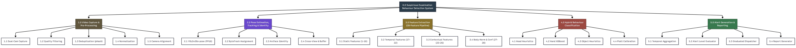

# Hierarchy Plus Input-Process-Output (HIPO) Specifications

## Project Information
- **Project Title:** Detection of Suspicious Examination Behaviours Using Human Pose Estimation and Deep Learning
- **Institution:** DMMMSU - South La Union Campus | BS Computer Science (AY 2025-2026)
- **Deployment Platform:** Desktop Application (PyQt6 with GPU-accelerated PyTorch/CUDA backend)
- **Inference Specification:** 3 FPS inference rate (333 ms sample window), 60-frame state buffer (20-second temporal memory), sub-50ms processing latency per frame pipeline.

---

# Descriptive Definition of HIPO Diagram

The **Hierarchy Plus Input-Process-Output (HIPO)** diagram is a classic systems analysis and structured software design documentation methodology. It provides a top-down modular representation of a complex system, partitioning major system goals into a hierarchical functional tree while defining exact data inputs, algorithmic transformations, and system outputs for each module.

A complete HIPO package consists of two main components:
1. **Visual Table of Contents (VTOC):** A hierarchical diagram depicting the parent-child structural decomposition of the application, organizing functions into top-level system modules, major subsystem components, and operational sub-modules.
2. **Input-Process-Output (IPO) Charts:** Detailed tabular and flow specifications for every module in the hierarchy, explicit about input data structures, internal processing operations (algorithms, neural network inferences, mathematical transformations, heuristic rule evaluations), and resulting data outputs/state updates.

### Grounded Project Scope & Architecture
Based on the project specifications documented in `project_progress.md`, the HIPO diagram models the **Suspicious Examination Behaviour Detection System** as a 5-tier functional hierarchy:
- **1.0 Video Ingestion & Spatial Calibration Subsystem:** Ingests dual 1080p @ 30 FPS video feeds (Camera 1: Middle Top View, Camera 2: Top Side View), applies quality filters (Laplacian blur variance $< 50$, overexposure $> 80\% > 245$), drops near-duplicate frames via 64-bit pHash (Hamming distance $< 5$), resizes to $640 \times 640$ letterboxed tensors, and applies a $3 \times 3$ Homography matrix for perspective alignment.
- **2.0 Pose Estimation, Tracking & Identity Verification Subsystem:** Executes half-precision (FP16) YOLOv26s-pose CUDA inference at 3 FPS to extract 17 COCO keypoints, applies ByteTrack Kalman filter tracking for persistent ID assignment across occlusions, executes ArcFace (`antelopev2`) face matching every 10 seconds for student identity verification and seat-swap detection, and manages a 60-frame (20-second) sliding state buffer.
- **3.0 28-Feature Extraction & Normalization Subsystem:** Transforms raw keypoint coordinates into an unpadded 28-element feature vector normalized by inter-shoulder distance, categorized into Static Posture Geometry (Features 1–16), Temporal Dynamics & Angular Velocities (Features 17–22), Contextual & Spatial Interactions (Features 23–26), and Confidence & Scale Normalization parameters (Features 27–28).
- **4.0 Hybrid Suspicious Behaviour Classification Subsystem:** Evaluates head-oriented cheating behaviors (*side glancing, head down, standing*) using deterministic geometry rules, evaluates hand-oriented behaviors (*passing notes, hand signaling*) using an XGBoost decision tree classifier, evaluates workspace violations using contextual heuristics, and calibrates raw logits into probability estimates ($P_{\text{calibrated}} \in [0.0, 1.0]$) using Platt scaling ($A \cdot f + B$).
- **5.0 Temporal Aggregation, Alerting & Reporting Subsystem:** Aggregates classification outputs over a 3-second (9-sample) sliding buffer consensus window, assigns graduated alert levels (**Yellow**, **Orange**, **Red**), dispatches visual/audio notifications to the PyQt6 proctor interface, captures bounding-box evidence snapshots, and generates post-exam analytical audit reports.

---

# Visual Table of Contents (VTOC)

# Input-Process-Output (IPO) Subsystem Specifications

## Subsystem 1.0 — Video Ingestion & Spatial Calibration

### Module 1.1: Dual-Camera Frame Capture
- **Input:** Live dual RTSP/USB video streams (Cam 1: Middle Top View, Cam 2: Top Side View) at 1080p @ 30 FPS.
- **Process:** Multi-threaded OpenCV frame acquisition loop (`cv2.VideoCapture`). Maintains ring buffers to prevent frame dropping.
- **Output:** Raw 1080p RGB image matrices buffered in **D1a Raw Frame Buffer**; raw video stream committed to **D8 Video Archive**.

### Module 1.2: Quality Filtering (Blur & Exposure)
- **Input:** Raw RGB frame matrices from **D1a Raw Frame Buffer**; configuration thresholds ($\text{Var}_{\text{blur}} < 50$, Overexposure limit $> 80\% > 245$) from **D7 Configuration**.
- **Process:** Computes 2D Laplacian kernel variance $\sigma^2 = \text{Var}(\nabla^2 I)$. Calculates proportion of pixels with intensity $> 245$. Drops corrupted frames.
- **Output:** Quality-verified image frames.

### Module 1.3: Duplicate Removal (pHash Filter)
- **Input:** Quality-verified image frames; pHash Hamming distance threshold ($d_{\text{Hamming}} < 5$) from **D7 Configuration**.
- **Process:** Computes 64-bit perceptual hashes (pHash) on downsampled grayscale images using 2D Discrete Cosine Transform (DCT). Compares current frame pHash against preceding frame hash.
- **Output:** Filtered stream of unique image frames.

### Module 1.4: Frame Resizing & Normalization
- **Input:** Unique image frame stream; target dimensions ($640 \times 640$), letterbox border padding color (RGB 128,128,128).
- **Process:** Scales image while preserving aspect ratio, adds letterbox padding to reach $640 \times 640 \times 3$, converts RGB to BGR tensor format, scales pixel intensities to float range $[0.0, 1.0]$.
- **Output:** Normalized float32 image tensors.

### Module 1.5: Perspective Alignment (Homography)
- **Input:** Normalized float32 image tensors; checkerboard-derived $3 \times 3$ homography transformation matrix $\mathbf{H}$ from **D7 Configuration**.
- **Process:** Applies geometric spatial warping (`cv2.warpPerspective`) to align Camera 2's side angle onto Camera 1's coordinate plane.
- **Output:** Aligned $640 \times 640$ frame tensors committed to **D1b Clean Frame Buffer**.

---

## Subsystem 2.0 — Pose Estimation, Tracking & Re-ID

### Module 2.1: YOLOv26s-pose FP16 Inference
- **Input:** Pre-processed frame tensors from **D1b Clean Frame Buffer** sampled at 3 FPS; half-precision CUDA weights from **D6 Model Weights**.
- **Process:** Executes TensorRT FP16 YOLOv26s-pose forward pass. Extracts person bounding boxes $(x, y, w, h)$ and 17 COCO 2D keypoints $(x_i, y_i, c_i)$ with confidence thresholding ($c_i > 0.3$).
- **Output:** Per-person bounding box and 17-keypoint coordinate arrays written to **D2a Detections Store**.

### Module 2.2: ByteTrack Multi-Object ID Tracking
- **Input:** Current frame detections from **D2a Detections Store**; historical track states from **D2b Track Store**.
- **Process:** Executes two-stage association using Kalman filtering for motion prediction and IoU/keypoint spatial distance matching. Assigns persistent track IDs and maintains tracks through temporary occlusions.
- **Output:** Track-assigned keypoint instances stored in **D2b Track Store**.

### Module 2.3: ArcFace Facial Re-ID & Seat Swap Check
- **Input:** Tracked person bounding box crops; pre-registered student face embeddings (512-d) and seating roster from **D2b Track Store**.
- **Process:** Triggers every 10 seconds: crops facial region, extracts 512-dimensional ArcFace (`antelopev2`) embedding vector, computes cosine similarity against assigned student baseline. Flag seat swaps if similarity $< 0.60$.
- **Output:** Validated student ID mapping and seat-swap anomaly flags.

### Module 2.4: 60-Frame State Buffer Manager
- **Input:** Unified person tracks and keypoints from **D2b Track Store**.
- **Process:** Maintains a rolling FIFO state queue holding up to 60 historical pose frames (spanning 20 seconds at 3 FPS) per active examinee track ID. Prunes expired tracks.
- **Output:** 60-frame spatial-temporal pose histories saved in **D2b Track Store**.

---

## Subsystem 3.0 — 28-Feature Extraction & Normalization

### Module 3.1: Static Pose Features (Features 1–16)
- **Input:** Current frame keypoint coordinates from **D2b Track Store**.
- **Process:** Computes instantaneous posture geometry:
  - *Head Pose (1–5):* Yaw, Pitch, Roll angles (derived from eye-nose-ear spatial vectors), lateral head displacement, and head-shoulder vertical distance ratio.
  - *Hand Positions (6–10):* Left/Right wrist-to-shoulder Euclidean distances, average hand extension, and Left/Right wrist Y-coordinates relative to desk height.
  - *Torso Geometry (11–12):* Torso lateral lean angle and vertical spine compression ratio.
  - *Limb Segment Distances (13–16):* Left/Right shoulder-to-elbow and elbow-to-wrist segment lengths.
- **Output:** 16 un-normalized static posture features.

### Module 3.2: Temporal Movement Features (Features 17–22)
- **Input:** 60-frame keypoint history buffer from **D2b Track Store**.
- **Process:** Computes spatial dynamics over time:
  - *Yaw Dynamics (17–18):* Head yaw velocity ($\Delta \text{Yaw}/\Delta t$) and acceleration ($\Delta^2 \text{Yaw}/\Delta t^2$).
  - *Hand Dynamics (19 & 22):* Wrist spatial velocity ($\text{px/sec}$) and 2D spatial position variance over 60 frames.
  - *Persistence & Frequency (20–21):* Continuous off-center head persistence duration (seconds) and directional turn oscillation frequency.
- **Output:** 6 temporal movement features.

### Module 3.3: Contextual Interaction Features (Features 23–26)
- **Input:** Multi-examinee track states from **D2b Track Store**; seating grid layout.
- **Process:** Evaluates spatial relationships between adjacent examinees:
  - *Neighbor Proximity (23 & 26):* Wrist distance to neighbor's desk workspace; count of surrounding active examinees.
  - *Mutual Orientation (24):* Binary indicator of reciprocal head-turn alignment between adjacent examinees.
  - *Seat Position (25):* Relative grid coordinates within classroom layout.
- **Output:** 4 contextual relationship features.

### Module 3.4: Inter-Shoulder Scale Normalization (Features 27–28)
- **Input:** Raw features 1–26; keypoint confidence scores; inter-shoulder distance $d_{\text{shoulder}}$.
- **Process:** Calculates mean keypoint confidence $c_{\text{mean}}$ (Feature 27) and detection confidence (Feature 28). Divides all spatial distance metrics (Features 4, 6–10, 13–16, 23) by $d_{\text{shoulder}}$ to eliminate scale variation caused by height or camera distance.
- **Output:** Standardized 28-element feature vector committed to **D3 Feature Store**.

---

## Subsystem 4.0 — Hybrid Behaviour Classification & Calibration

### Module 4.1: Head Behaviour Heuristics
- **Input:** Features 1–5, 17, 20 from **D3 Feature Store**.
- **Process:** Evaluates rule-based geometric constraints:
  - *Side Glancing:* $|\text{Yaw}| > 30^\circ$ for $> 1.5$ seconds.
  - *Head Down:* $\text{Pitch} < -25^\circ$ for $> 3.0$ seconds.
  - *Standing Up:* Vertical shoulder/hip displacement $> 0.3 \times \text{body height}$.
- **Output:** Head behavior class labels and raw heuristic scores.

### Module 4.2: Hand Behaviour XGBoost Classifier
- **Input:** Features 6–10, 13–16, 19, 22–24 from **D3 Feature Store**; trained XGBoost weights from **D6 Model Weights**.
- **Process:** Executes gradient-boosted decision tree inference to evaluate complex manual movement patterns (*passing notes, hand signaling*).
- **Output:** Hand behavior class probabilities.

### Module 4.3: Workspace Context Object Heuristic
- **Input:** Features 9–10, 23, 25 from **D3 Feature Store**.
- **Process:** Evaluates joint constraints of sustained hand placement in desk zones combined with pitch tilt toward lap areas to flag unauthorized object usage (e.g., hidden phones or notes).
- **Output:** Object violation label and raw score.

### Module 4.4: Platt Scaling Confidence Calibration
- **Input:** Raw scores from 4.1–4.3; Platt scaling parameters $(A, B)$ from **D6 Model Weights**.
- **Process:** Applies logistic sigmoid transformation:
  $$P(y=1|f) = \frac{1}{1 + \exp(A \cdot f + B)}$$
  mapping raw model outputs to well-calibrated posterior probabilities $P_{\text{calibrated}} \in [0.0, 1.0]$.
- **Output:** Calibrated classification results committed to **D4 Classification Store**.

---

## Subsystem 5.0 — Temporal Aggregation, Alerting & Reporting

### Module 5.1: 3-Second Temporal Consensus Aggregator
- **Input:** Classification results from **D4 Classification Store**.
- **Process:** Maintains a rolling 3-second (9-sample) sliding window buffer. Computes ratio of flagged frames to require sustained temporal consensus before dispatching alerts.
- **Output:** Temporally aggregated consensus confidence scores.

### Module 5.2: Graduated Alert Rule Engine
- **Input:** Aggregated consensus scores; alert threshold rules from **D7 Configuration**.
- **Process:** Compares consensus scores against graduated rules:
  - **Yellow Alert:** Single detection ($P_{\text{calibrated}} > 0.50$) or $< 30\%$ of buffer flagged.
  - **Orange Alert:** $30\%\text{--}60\%$ of buffer flagged or behavior sustained $\ge 3$ seconds.
  - **Red Alert:** $> 60\%$ of buffer flagged with average confidence $> 0.70$.
- **Output:** Assigned alert level (**Yellow**, **Orange**, or **Red**).

### Module 5.3: Real-Time Proctor UI Dispatcher
- **Input:** Assigned alert level; examinee identity; frame buffer.
- **Process:** Dispatches alerts according to tier:
  - *Yellow:* Silent logging to session database.
  - *Orange:* Pop-up notification toast in PyQt6 sidebar interface.
  - *Red:* Visual screen flashing, audible chime trigger, automated bounding-box screenshot capture, and immediate desktop notification.
- **Output:** Real-time proctor UI notifications; event records and evidence screenshots committed to **D5 Alert Log**.

### Module 5.4: Post-Exam Audit Report Exporter
- **Input:** Historical logs from **D5 Alert Log**; raw video recordings from **D8 Video Archive**.
- **Process:** Synthesizes session alert events, examinee rosters, temporal anomaly timelines, and overall exam integrity indices into formatted post-exam audit reports (PDF / HTML summaries).
- **Output:** Post-examination analytical proctoring reports.

---

# Functional Decomposition Summary Table

| Module ID | Module Name | Subsystem Parent | Processing Rate / Frequency | Primary Input | Primary Output | Target Latency / Metric |
|---|---|---|---|---|---|---|
| **1.1** | Dual-Camera Capture | 1.0 Video Ingestion | 30 FPS (Continuous) | Dual RTSP/USB Video | Raw RGB Frame Matrices | Zero frame drop |
| **1.2** | Quality Filtering | 1.0 Video Ingestion | 30 FPS | Raw RGB Frames | Quality-Passed Frames | $\text{Var}_{\text{blur}} \ge 50$ |
| **1.3** | Duplicate Removal | 1.0 Video Ingestion | 30 FPS | Passed Frames | Unique Frames | $d_{\text{Hamming}} \ge 5$ |
| **1.4** | Frame Resizing | 1.0 Video Ingestion | 30 FPS | Unique Frames | $640 \times 640$ Tensors | Letterboxed padding |
| **1.5** | Perspective Alignment | 1.0 Video Ingestion | 30 FPS | Normalized Tensors | Aligned Frame Tensors | $3 \times 3$ Homography warp |
| **2.1** | YOLOv26s-pose FP16 | 2.0 Pose & Tracking | 3 FPS (333 ms) | Aligned Frame Tensors | Bboxes + 17 Keypoints | sub-25ms GPU inference |
| **2.2** | ByteTrack Tracking | 2.0 Pose & Tracking | 3 FPS | Detections Array | Persistent Track IDs | Kalman filter association |
| **2.3** | ArcFace Re-ID | 2.0 Pose & Tracking | Every 10 Seconds | Face Crops | Student ID Mapping | Seat swap alert |
| **2.4** | State Buffer Manager | 2.0 Pose & Tracking | 3 FPS | Tracked Keypoints | 60-Frame State Buffer | 20-second pose history |
| **3.1** | Static Pose Features | 3.0 Feature Extract | 3 FPS | Current Frame Keypoints | Features 1–16 | 16 Posture angles |
| **3.2** | Temporal Features | 3.0 Feature Extract | 3 FPS | 60-Frame History Buffer | Features 17–22 | 6 Dynamic movement metrics |
| **3.3** | Contextual Features | 3.0 Feature Extract | 3 FPS | Multi-Person Tracks | Features 23–26 | 4 Neighbor interaction metrics |
| **3.4** | Scale Normalization | 3.0 Feature Extract | 3 FPS | Raw Features 1–26 | 28-Feature Vector | Scaled by $d_{\text{shoulder}}$ |
| **4.1** | Head Heuristics | 4.0 Classification | 3 FPS | Features 1–5, 17, 20 | Head Behavior Labels | $|\text{Yaw}| > 30^\circ$, Pitch $<-25^\circ$ |
| **4.2** | Hand XGBoost | 4.0 Classification | 3 FPS | Features 6–10, 13–16 | Hand Behavior Probabilities | Gradient boosted trees |
| **4.3** | Object Heuristic | 4.0 Classification | 3 FPS | Features 9–10, 23, 25 | Object Violation Score | Hand-desk workspace check |
| **4.4** | Platt Calibration | 4.0 Classification | 3 FPS | Raw Classifier Logits | Calibrated Probabilities | $P_{\text{calibrated}} \in [0.0, 1.0]$ |
| **5.1** | Temporal Consensus | 5.0 Alerting & Report | 3 FPS | Calibrated Probabilities | Consensus Confidence | 3-second sliding window |
| **5.2** | Alert Determination | 5.0 Alerting & Report | Event-driven | Consensus Scores | Alert Severity Tier | **Yellow** / **Orange** / **Red** |
| **5.3** | Real-Time UI Dispatch | 5.0 Alerting & Report | Event-driven | Assigned Alert Tier | Proctor UI Alerts | Toast, screen flash, audio |
| **5.4** | Audit Report Exporter | 5.0 Alerting & Report | Post-Session | Session Logs & Video | Analytical Audit Report | PDF / HTML summary |

---

*Last updated: Academic Year 2025–2026*
