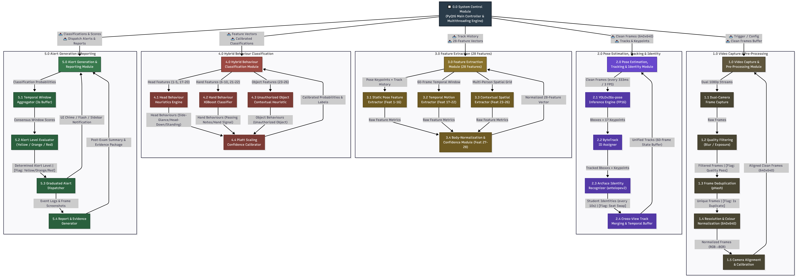

# Structure Chart (Structured Chart) Specifications & Program Architecture

## Project Information
- **Project Title:** Detection of Suspicious Examination Behaviours Using Human Pose Estimation and Deep Learning
- **Institution:** DMMMSU - South La Union Campus | BS Computer Science (AY 2025-2026)
- **Deployment Platform:** Desktop Application (PyQt6 with GPU-accelerated PyTorch/CUDA backend)
- **Inference Specification:** 3 FPS inference rate (333 ms sample window), 60-frame state buffer (20-second temporal memory), sub-50ms processing latency per frame pipeline.

---

# Descriptive Definition of Structure Chart

A **Structure Chart** (also referred to as a **Structured Chart**) is a top-down architectural diagram used in software engineering to model the program hierarchy, module call sequences, control structures, parameter passing, and procedural control signals within a software system.

Unlike Data Flow Diagrams (DFDs)—which model the movement and transformation of data through operational processes—a Structure Chart models the actual **program execution hierarchy and module calling structure**. It illustrates how software functions call one another, how data parameters (**Data Couples**) are passed between modules, and how control signals (**Control Couples** or flags) govern conditional branching and loop execution.

### Grounded Project Architecture & Multi-Threaded Control Structure
Based on the project specifications documented in `project_progress.md`, the Structure Chart details the modular software architecture of the desktop application built using **PyQt6** and a **CUDA-accelerated PyTorch/TensorRT** inference engine:
1. **Multi-Threaded Architecture:**
   - **Thread 1 (Capture Thread):** Continuous 30 FPS OpenCV video ingestion loop for Camera 1 (Middle Top View) and Camera 2 (Top Side View), executing quality checks and homography alignment.
   - **Thread 2 (Inference & Analysis Thread):** Asynchronous GPU inference pipeline running every 333 ms (3 FPS). Executes YOLOv26s-pose keypoint estimation, ByteTrack motion tracking, ArcFace (`antelopev2`) identity matching, 28-feature extraction, hybrid classification (head heuristics + hand XGBoost models), and Platt scaling calibration.
   - **Thread 3 (PyQt6 Main GUI Thread):** Event loop managing real-time video rendering, bounding-box overlay drawing, graduated alert notification toasts (**Yellow**, **Orange**, **Red**), evidence snapshot displays, and post-exam report exports.
2. **Module Hierarchy & Call Decomposition:** Models the program control flow from the root `0.0 Main System Controller (PyQt6 Application)` down to specialized functional workers across 5 operational modules:
   - `1.0 Frame Acquisition Controller`
   - `2.0 Pose & Track Processing Manager`
   - `3.0 Feature Extraction Manager`
   - `4.0 Behaviour Classification Engine`
   - `5.0 Notification & Audit Manager`
3. **Data Couples & Control Couples:**
   - **Data Couples ($\circ\longrightarrow$):** Data structures passed across module interfaces, including raw frame matrices, normalized image tensors, bounding box coordinates, 17 COCO keypoint arrays, 60-frame history queues, 28-element feature vectors, classifier probabilities ($P_{\text{calibrated}}$), student IDs, and alert incident payloads.
   - **Control Couples ($\bullet\longrightarrow$):** Flag signals governing workflow execution, such as `Frame_Ready_Flag`, `Blur_Reject_Flag`, `Duplicate_Frame_Flag`, `Occlusion_Detected_Flag`, `Seat_Swap_Flag`, `Buffer_Consensus_Flag`, `Alert_Level_Signal`, and `Export_Report_Trigger`.

---

# Visual Structure Chart Diagram

# Program Call Hierarchy & Module Specifications

### 0.0 Main System Controller (`main.py` / `PyQt6 Application Window`)
- **Function:** Root application controller. Initializes worker threads, configures shared thread-safe queues, sets up PyQt6 UI widgets, binds user actions, and manages system state.
- **Child Call Invocations:** Calls `1.0 Frame Acquisition Controller`, `2.0 Pose & Track Processing Manager`, `3.0 Feature Extraction Manager`, `4.0 Behaviour Classification Engine`, and `5.0 Notification & Audit Manager`.
- **Thread Scope:** Main GUI Thread (Thread 3).

---

### 1.0 Frame Acquisition Controller (`camera_handler.py`)
- **Function:** Coordinates video ingestion from dual camera devices, quality verification, and spatial perspective alignment.
- **Thread Scope:** Capture Thread (Thread 1 - 30 FPS).
- **Sub-module Calls:**
  - **`1.1 Dual-Camera Frame Grabber`:** Binds RTSP/USB streams for Camera 1 (Overhead) and Camera 2 (Side-angle). Emits raw 1080p RGB matrices.
  - **`1.2 Quality & Duplicate Filter Worker`:** Evaluates 2D Laplacian variance for blur and perceptual hashing (64-bit pHash) for duplicate frame removal. Returns `Quality_Pass_Flag`.
  - **`1.3 Homography Perspective Warper`:** Applies $3 \times 3$ matrix spatial transformation to align Camera 2's angle onto Camera 1's perspective. Returns letterboxed $640 \times 640$ normalized float tensors.

---

### 2.0 Pose & Track Processing Manager (`pose_engine.py`)
- **Function:** Executes GPU-accelerated pose estimation, multi-person tracking, facial re-identification, and historical state buffer management.
- **Thread Scope:** GPU Inference Thread (Thread 2 - 3 FPS / 333 ms window).
- **Sub-module Calls:**
  - **`2.1 YOLOv26s-pose FP16 Estimator`:** Executes half-precision TensorRT/PyTorch inference to detect bounding boxes $(x,y,w,h)$ and 17 COCO keypoints $(x_i, y_i, c_i)$.
  - **`2.2 ByteTrack Motion Associator`:** Performs two-stage Kalman filter tracking to assign persistent Track IDs across frames.
  - **`2.3 ArcFace Re-ID & Seat Check Engine`:** Crops facial regions every 10 seconds, computes 512-d ArcFace embeddings, compares against assigned seat roster, and emits `Seat_Swap_Flag`.
  - **`2.4 60-Frame State Buffer Manager`:** Manages rolling 60-frame (20-second) pose trajectory histories per active examinee ID.

---

### 3.0 Feature Extraction Manager (`feature_extractor.py`)
- **Function:** Transforms raw 60-frame keypoint history into a 28-element body-normalized feature vector.
- **Thread Scope:** GPU Inference Thread (Thread 2).
- **Sub-module Calls:**
  - **`3.1 Static Pose Angle Calculator`:** Calculates instantaneous head yaw/pitch/roll angles, hand-wrist distance, torso lean angle, and limb segment lengths (Features 1–16).
  - **`3.2 Temporal Dynamics Evaluator`:** Calculates yaw velocity/acceleration, hand spatial speed, head persistence duration, turn frequency, and hand variance over 60 frames (Features 17–22).
  - **`3.3 Contextual Spatial Calculator`:** Evaluates neighbor wrist distance, mutual head turn alignment, and seating position (Features 23–26).
  - **`3.4 Proportional Scale Normalizer`:** Computes mean keypoint confidence (Feature 27), overall confidence (Feature 28), and scales spatial distance features by inter-shoulder width $d_{\text{shoulder}}$.

---

### 4.0 Behaviour Classification Engine (`classifier.py`)
- **Function:** Executes hybrid classification combining heuristic rules, XGBoost decision trees, and Platt scaling probability calibration.
- **Thread Scope:** GPU Inference Thread (Thread 2).
- **Sub-module Calls:**
  - **`4.1 Head Heuristic Evaluator`:** Evaluates deterministic geometric thresholds for *Side Glancing* ($|\text{Yaw}| > 30^\circ$), *Head Down* ($\text{Pitch} < -25^\circ$), and *Standing Up*.
  - **`4.2 Hand XGBoost Evaluator`:** Evaluates gradient-boosted decision trees on hand movement features to detect *Passing Notes* and *Hand Signaling*.
  - **`4.3 Workspace Object Evaluator`:** Evaluates hand-desk workspace placement and lap-directed pitch tilt to detect *Unauthorized Object Use*.
  - **`4.4 Platt Calibration Engine`:** Applies logistic sigmoid transformation $P(y=1|f) = 1 / (1 + \exp(A \cdot f + B))$ to map raw scores into calibrated probabilities $P_{\text{calibrated}} \in [0.0, 1.0]$.

---

### 5.0 Notification & Audit Manager (`alert_manager.py`)
- **Function:** Aggregates classification output across temporal windows, determines graduated alert levels, dispatches UI alerts, captures evidence, and exports reports.
- **Thread Scope:** Main GUI Thread & Background Persistence Worker.
- **Sub-module Calls:**
  - **`5.1 3-Second Buffer Consensus Aggregator`:** Evaluates 9-sample sliding window to ensure sustained behavior consensus before triggering alerts.
  - **`5.2 Alert Severity Rule Engine`:** Evaluates consensus ratio against severity tier rules: **Yellow** (log only), **Orange** (sidebar toast), **Red** (flash + chime + snapshot).
  - **`5.3 UI Dispatcher & Media Controller`:** Renders bounding boxes on proctor video display, triggers audio chime, displays sidebar toast, and saves JPEG evidence snapshots.
  - **`5.4 Post-Exam Audit Report Exporter`:** Compiles session alert logs, examinee rosters, anomaly timelines, and video archives into analytical PDF/HTML reports.

---

# Data Couples & Control Couples Dictionary

### 1. Data Couples Dictionary ($\circ\longrightarrow$)
Data parameters passed between software modules during call execution:

| Data Couple Name | Originating Module | Destination Module | Data Type & Description |
|---|---|---|---|
| `Raw_Video_Stream` | `1.1 Frame Grabber` | `1.2 Quality Filter` | 1080p @ 30 FPS RGB image matrix (`np.ndarray`) |
| `Clean_Frame_Tensor` | `1.3 Homography Warper` | `2.1 YOLO FP16 Estimator` | $640 \times 640 \times 3$ normalized float32 tensor |
| `Pose_Detections` | `2.1 YOLO FP16 Estimator` | `2.2 ByteTrack` | Bounding boxes $(x,y,w,h)$ + 17 keypoints $(x_i,y_i,c_i)$ |
| `Tracked_Pose_Instance`| `2.2 ByteTrack` | `2.4 Buffer Manager` | Track ID + spatial keypoint coordinates |
| `ArcFace_Embedding_512`| `2.3 ArcFace Re-ID` | `0.0 Main Controller` | 512-dimensional floating-point biometric vector |
| `60_Frame_Pose_History` | `2.4 Buffer Manager` | `3.1–3.3 Feature Calculators` | 20-second queue of 17 keypoint coordinates |
| `Feature_Vector_28` | `3.4 Scale Normalizer` | `4.1–4.3 Classifiers` | 28-element normalized feature array (`float32[28]`) |
| `Raw_Classifier_Logits`| `4.1–4.3 Classifiers` | `4.4 Platt Calibration` | Uncalibrated heuristic & XGBoost output scores |
| `Calibrated_Probabilities`| `4.4 Platt Calibration` | `5.1 Buffer Aggregator` | $P_{\text{calibrated}} \in [0.0, 1.0]$ per behavior class |
| `Consensus_Scores` | `5.1 Buffer Aggregator` | `5.2 Alert Rule Engine` | 3-second (9-sample) sliding window consensus ratio |
| `Alert_Incident_Payload`| `5.2 Alert Rule Engine` | `5.3 UI Dispatcher` | Alert level, student ID, timestamp, screenshot path |

---

### 2. Control Couples Dictionary ($\bullet\longrightarrow$)
Control signals and flags governing conditional execution and program branching:

| Control Couple Name | Originating Module | Destination Module | Value Domain & Description |
|---|---|---|---|
| `Quality_Pass_Flag` | `1.2 Quality Filter` | `1.0 Acquisition Controller` | `BOOLEAN`: `TRUE` if $\text{Var}_{\text{blur}} \ge 50$ & exposure normal. |
| `Duplicate_Frame_Flag` | `1.2 Quality Filter` | `1.0 Acquisition Controller` | `BOOLEAN`: `TRUE` if pHash Hamming distance $< 5$. |
| `Frame_Ready_Signal` | `1.0 Acquisition Controller`| `2.0 Pose Manager` | `EVENT_SIGNAL`: Triggers GPU inference every 333 ms. |
| `Occlusion_Flag` | `2.2 ByteTrack` | `2.0 Pose Manager` | `BOOLEAN`: `TRUE` if keypoint visibility $< 40\%$. |
| `Seat_Swap_Flag` | `2.3 ArcFace Re-ID` | `5.2 Alert Rule Engine` | `BOOLEAN`: `TRUE` if face embedding similarity $< 0.60$. |
| `Buffer_Consensus_Flag` | `5.1 Buffer Aggregator` | `5.2 Alert Rule Engine` | `BOOLEAN`: `TRUE` if $>30\%$ or $>60\%$ frames flagged. |
| `Alert_Severity_Tier` | `5.2 Alert Rule Engine` | `5.3 UI Dispatcher` | `ENUM`: `YELLOW`, `ORANGE`, `RED`, or `NONE`. |
| `Proctor_Ack_Signal` | `5.3 UI Dispatcher` | `0.0 Main Controller` | `BOOLEAN`: User acknowledged UI alert toast. |
| `Export_Report_Trigger` | `0.0 Main Controller` | `5.4 Report Exporter` | `SIGNAL`: Session ended; generate audit PDF/HTML. |

---

# Architectural Cohesion & Coupling Analysis

### Module Cohesion Assessment
The software system exhibits **High Functional Cohesion**. Each sub-module is designed to perform a single, well-defined mathematical, neural, or logical transformation:
- Module `1.2` handles *only* frame quality filtering.
- Module `2.1` handles *only* YOLOv26s-pose CUDA inference.
- Module `3.4` handles *only* inter-shoulder scale normalization.
- Module `4.4` handles *only* Platt scaling sigmoid calibration.
- Module `5.2` handles *only* graduated alert severity determination.

### Module Coupling Assessment
The application exhibits **Loose Data Coupling**. Subsystems do not modify internal private states of sibling modules. Communication across thread boundaries is achieved strictly using:
- **Thread-safe FIFO queues (`PyQt6 pyqtSignal` and `Python queue.Queue`):** Prevents main loop thread blocking while passing data couples (`Clean_Frame_Tensor`, `Feature_Vector_28`, `Alert_Incident_Payload`).
- **Standardized Interfaces:** All feature extraction algorithms accept uniform keypoint structures and emit float arrays of fixed length 28.
- **Decoupled Alert Dispatch:** Alert generation is decoupled from rendering; the UI dispatcher listens to emitted signals without blocking GPU inference threads.

---

*Last updated: Academic Year 2025–2026*
