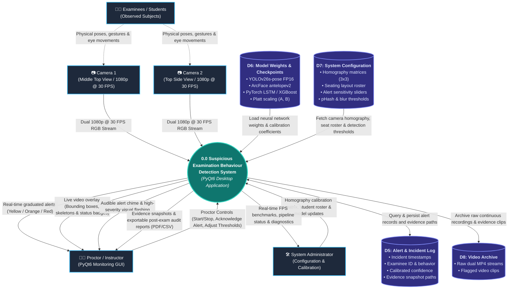
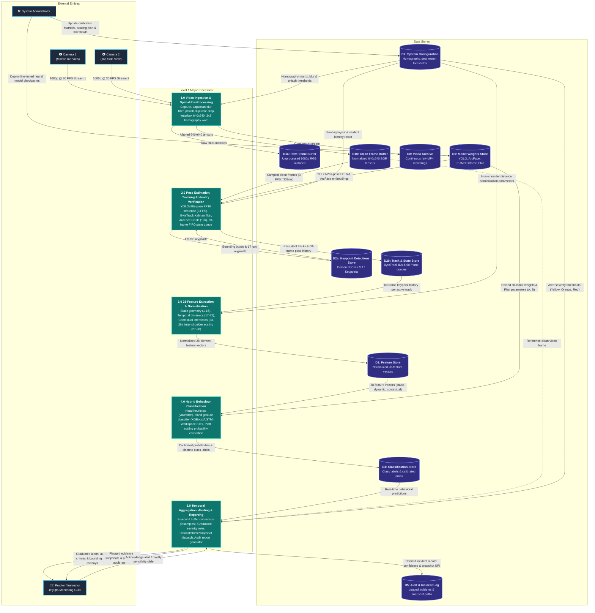

# Data Flow Diagram (DFD) Specifications & Mermaid Models

## Project Information
- **Project Title:** Detection of Suspicious Examination Behaviours Using Human Pose Estimation and Deep Learning
- **Institution:** DMMMSU - South La Union Campus | BS Computer Science (AY 2025-2026)
- **Deployment Platform:** Desktop Application (PyQt6 with GPU-accelerated PyTorch/CUDA backend)
- **Inference Specification:** 3 FPS inference rate (333 ms sample window), 60-frame state buffer (20-second temporal memory), sub-50ms processing latency per frame pipeline.
- **Location:** `2_Documentation/charts_and_graphs/mermaid_diagrams/DFD.md`

---

## 1. Overview of Data Flow Diagram Architecture

The Data Flow Diagrams (DFDs) model the flow of data through the AI-assisted examination surveillance system, depicting how raw multi-angle video feeds are captured, pre-processed, analyzed for human poses, feature-engineered, classified into suspicious behavioral patterns, and transformed into real-time proctoring alerts and post-exam audit reports.

The DFD specification is structured into three progressive abstraction stages:
1. **Stage 0 — Context Diagram (Level 0 DFD):** Defines the overall system scope, external entities, high-level inputs/outputs, and persistent data store interactions.
2. **Stage 1 — Major System Processes (Level 1 DFD):** Decomposes the single system process into 5 core operational modules and maps primary data pipelines between data stores.
3. **Stage 2 — Sub-Processes & Functional Decomposition (Level 2 DFD):** Breaks down each Level 1 process into 21 granular sub-processes, detailing algorithmic transformations, heuristic thresholds, machine learning models, and temporal buffers.

---

## 2. Stage 0 — Context Diagram (Level 0 DFD)

### Purpose & External Entities
Stage 0 represents the system as a single central process (**Process 0: Suspicious Examination Behaviour Detection System**) surrounded by its external environment.
- **Camera 1 (Middle Top View):** Overhead primary video capture device delivering 1080p RGB video streams at 30 fps.
- **Camera 2 (Top Side View):** Secondary angular video capture device delivering complementary 1080p RGB streams at 30 fps to eliminate body/desk occlusions.
- **Students / Examinees:** Human subjects whose physical posture, head position, facial orientation, and hand movements generate spatial-temporal pose observations.
- **Proctor / Instructor:** Primary human recipient of surveillance outputs. Receives real-time visual alerts, audio notifications, evidence snapshots, and post-exam analytical summaries.
- **System Administrator:** System manager responsible for configuring spatial homography calibration, setting alert sensitivity thresholds, and uploading updated model weights.

### Level 0 Mermaid Diagram

---

## 3. Stage 1 — Major System Processes (Level 1 DFD)

### Overview & Process Decomposition
Stage 1 expands Process 0 into five foundational operational processes (**1.0 through 5.0**):
- **1.0 Video Ingestion & Spatial Pre-Processing:** Ingests synchronized dual 1080p video streams at 30 fps, filters blur and near-duplicate frames, normalizes tensors, and aligns perspectives using homography.
- **2.0 Pose Estimation, Tracking & Identity Verification:** Runs YOLOv26s-pose at 3 FPS, performs ByteTrack motion tracking, runs ArcFace Re-ID every 10 seconds, and manages a 60-frame state buffer.
- **3.0 28-Feature Extraction & Normalization:** Transforms keypoints into an unpadded 28-element feature vector normalized by inter-shoulder width.
- **4.0 Hybrid Behaviour Classification:** Combines deterministic head posture heuristics with trained XGBoost/LSTM classifiers and Platt scaling calibration.
- **5.0 Temporal Aggregation, Alerting & Reporting:** Evaluates a 3-second consensus window, assigns graduated alert levels (Yellow, Orange, Red), pushes visual/audible alerts, and compiles session audit reports.

### Level 1 Mermaid Diagram

---

## 4. Stage 2 — Sub-Processes & Functional Decomposition (Level 2 DFD)

### Granular Functional Decomposition (Sub-Processes 1.1 through 5.4)
- **1.0 Video Ingestion & Spatial Pre-Processing:**
  - `1.1` Dual-Camera Frame Grabber (`cv2.VideoCapture` 30 FPS ring buffer)
  - `1.2` Quality Filtering (Laplacian variance $\sigma^2 < 50$ for blur; pixel $> 245$ for overexposure)
  - `1.3` Duplicate Removal (64-bit DCT perceptual hash, Hamming distance $< 5$)
  - `1.4` Frame Resizing & Normalization (Letterbox padding to $640 \times 640$, float32 $[0.0, 1.0]$)
  - `1.5` Perspective Alignment ($3 \times 3$ homography transformation warping)
- **2.0 Pose Estimation, Tracking & Identity Verification:**
  - `2.1` YOLOv26s-pose FP16 CUDA Forward Pass (17 COCO keypoints + bounding boxes)
  - `2.2` ByteTrack Two-Stage Motion Tracking (Kalman filter spatial association)
  - `2.3` ArcFace Re-ID & Seat Swap Check (512-d facial embedding cosine similarity $< 0.60$)
  - `2.4` 60-Frame State Buffer Manager (FIFO rolling temporal pose queue)
- **3.0 28-Feature Extraction & Normalization:**
  - `3.1` Static Pose Features (Features 1–16: Head angles, wrist extension, torso lean)
  - `3.2` Temporal Movement Features (Features 17–22: Angular velocity, wrist speed, turn frequency)
  - `3.3` Contextual & Spatial Interaction Features (Features 23–26: Neighbor proximity, mutual alignment)
  - `3.4` Confidence & Scale Normalization (Features 27–28: Inter-shoulder normalization factor $d_{\text{shoulder}}$)
- **4.0 Hybrid Behaviour Classification:**
  - `4.1` Head Behaviour Heuristics ($|\text{Yaw}| > 30^\circ$, $\text{Pitch} < -25^\circ$, standing displacement)
  - `4.2` Hand Gesture Classifier (XGBoost / LSTM decision network for note passing & signaling)
  - `4.3` Unauthorized Object Contextual Heuristic (Lap-directed pitch + wrist desk interaction)
  - `4.4` Platt Scaling Calibration ($P(y=1|f) = 1 / (1 + \exp(A \cdot f + B))$)
- **5.0 Temporal Aggregation, Alerting & Reporting:**
  - `5.1` 3-Second Temporal Consensus Aggregator (9-sample sliding buffer consensus)
  - `5.2` Alert Level Determination (Yellow $< 30\%$, Orange $30\text{--}60\%$, Red $> 60\%$ & conf $> 0.70$)
  - `5.3` Graduated Alert Dispatcher (Sidebar toast, audio chime, screen flash, JPEG snapshot)
  - `5.4` Post-Exam Audit Report & Evidence Exporter (PDF/CSV session audit generation)

### Level 2 Mermaid Diagram

```mermaid
flowchart TB
    %% External Entities
    E1["📷 Camera 1 (Overhead)"]
    E2["📷 Camera 2 (Side-angle)"]
    E4["👨‍🏫 Proctor UI / Instructor"]

    %% SUB-SYSTEM 1.0
    subgraph P1_Sub ["1.0 Video Ingestion & Spatial Pre-Processing"]
        P11["1.1 Dual-Camera Frame Grabber<br>• cv2.VideoCapture multi-thread<br>• 1080p @ 30 FPS"]
        P12["1.2 Quality Filtering<br>• Laplacian variance blur test<br>• Overexposure check (>245)"]
        P13["1.3 Duplicate Frame Removal<br>• 64-bit pHash computation<br>• Drop Hamming dist < 5"]
        P14["1.4 Frame Resizing & Normalization<br>• Letterbox padding to 640x640<br>• Pixel scaling [0.0, 1.0]"]
        P15["1.5 Perspective Alignment<br>• 3x3 Homography warping<br>• Merge Camera 2 into Camera 1 view"]
    end

    %% SUB-SYSTEM 2.0
    subgraph P2_Sub ["2.0 Pose Estimation, Tracking & Identity Verification"]
        P21["2.1 YOLOv26s-pose FP16 Inference<br>• CUDA forward pass @ 3 FPS<br>• 17 COCO Keypoints + BBoxes"]
        P22["2.2 ByteTrack Motion Association<br>• Two-stage Kalman filter<br>• Persistent Track ID across occlusion"]
        P23["2.3 ArcFace Re-ID & Seat Swap Check<br>• 512-d facial embedding (10s)<br>• Compare against seat roster"]
        P24["2.4 60-Frame State Buffer Manager<br>• Rolling FIFO temporal queue<br>• Prune expired stale tracks"]
    end

    %% SUB-SYSTEM 3.0
    subgraph P3_Sub ["3.0 28-Feature Extraction & Normalization"]
        P31["3.1 Static Pose Features (1–16)<br>• Head Yaw, Pitch, Roll angles<br>• Wrist-to-shoulder distances<br>• Torso inclination angle"]
        P32["3.2 Temporal Dynamics Features (17–22)<br>• Yaw velocity & angular accel<br>• Wrist movement speed (px/s)<br>• Head turn persistence & frequency"]
        P33["3.3 Contextual Spatial Features (23–26)<br>• Neighbor wrist proximity<br>• Mutual head turn alignment<br>• Seating grid coordinates"]
        P34["3.4 Scale & Confidence Normalization (27–28)<br>• Mean keypoint confidence<br>• Divide distances by shoulder width"]
    end

    %% SUB-SYSTEM 4.0
    subgraph P4_Sub ["4.0 Hybrid Behaviour Classification"]
        P41["4.1 Head Cheating Heuristics<br>• Side glance: |Yaw| > 30° (>1.5s)<br>• Head down: Pitch < -25° (>3.0s)<br>• Standing up: vertical displacement"]
        P42["4.2 Hand Gesture Classifier<br>• XGBoost / LSTM model<br>• Passing notes & hand signaling"]
        P43["4.3 Workspace Violation Heuristic<br>• Lap-directed pitch + wrist at desk<br>• Concealed phone / note detection"]
        P44["4.4 Platt Scaling Calibration<br>• P(y=1|f) = 1 / (1 + exp(A·f + B))<br>• Map raw logits to [0.0, 1.0]"]
    end

    %% SUB-SYSTEM 5.0
    subgraph P5_Sub ["5.0 Temporal Aggregation, Alerting & Reporting"]
        P51["5.1 3-Second Consensus Aggregator<br>• 9-sample sliding buffer window<br>• Suppress single-frame spikes"]
        P52["5.2 Alert Level Determination<br>• Yellow (<30% buffer, minor)<br>• Orange (30-60% buffer, sustained)<br>• Red (>60% buffer & conf > 0.70)"]
        P53["5.3 Graduated Alert Dispatcher<br>• UI Toast (Orange)<br>• Audio chime & screen flash (Red)<br>• Save bounding box snapshot"]
        P54["5.4 Post-Exam Audit Report Exporter<br>• Aggregate session statistics<br>• Export integrity PDF/CSV reports"]
    end

    %% DATA STORES
    D1a[("D1a: Raw Frame Buffer")]
    D1b[("D1b: Clean Frame Buffer")]
    D2a[("D2a: Keypoint Store")]
    D2b[("D2b: Track & Buffer Store")]
    D3[("D3: Feature Store (28D)")]
    D4[("D4: Classification Store")]
    D5[("D5: Alert Log")]
    D6[("D6: Model Weights")]
    D7[("D7: Configuration")]
    D8[("D8: Video Archive")]

    %% Process 1.0 Internal Flow
    E1 & E2 --> P11
    P11 --> D1a & D8
    D1a --> P12
    D7 -.-> P12 & P13 & P15
    P12 --> P13 --> P14 --> P15 --> D1b

    %% Process 2.0 Internal Flow
    D1b --> P21
    D6 -.-> P21 & P23
    D7 -.-> P23
    P21 --> D2a --> P22
    P22 --> P23 --> P24 --> D2b

    %% Process 3.0 Internal Flow
    D2b --> P31 & P32 & P33
    P31 & P32 & P33 --> P34
    D7 -.-> P34
    P34 --> D3

    %% Process 4.0 Internal Flow
    D3 --> P41 & P42 & P43
    D6 -.-> P42 & P44
    P41 & P42 & P43 --> P44 --> D4

    %% Process 5.0 Internal Flow
    D4 --> P51
    D7 -.-> P52
    P51 --> P52 --> P53
    D1b -.-> P53
    P53 --> E4
    P53 --> D5
    D5 & D8 --> P54 --> E4

    %% Styling
    classDef entity fill:#1e293b,stroke:#38bdf8,stroke-width:2px,color:#f8fafc;
    classDef proc fill:#0f766e,stroke:#2dd4bf,stroke-width:1.5px,color:#ffffff;
    classDef store fill:#312e81,stroke:#818cf8,stroke-width:1.5px,color:#e0e7ff;

    class E1,E2,E4 entity;
    class P11,P12,P13,P14,P15,P21,P22,P23,P24,P31,P32,P33,P34,P41,P42,P43,P44,P51,P52,P53,P54 proc;
    class D1a,D1b,D2a,D2b,D3,D4,D5,D6,D7,D8 store;
```

