# Entity Relationship Diagram (ERD) Specifications & Mermaid Models

## Project Information
- **Project Title:** Detection of Suspicious Examination Behaviours Using Human Pose Estimation and Deep Learning
- **Institution:** DMMMSU - South La Union Campus | BS Computer Science (AY 2025-2026)
- **Deployment Platform:** Desktop Application (PyQt6 with GPU-accelerated PyTorch/CUDA backend)
- **Database Architecture:** Relational SQLite / PostgreSQL Schema for Persistent Surveillance and Audit Logging
- **Location:** `2_Documentation/charts_and_graphs/mermaid_diagrams/ERD.md`

---

## 1. Overview of ERD Schema & Relational Architecture

The **Entity Relationship Diagram (ERD)** defines the logical database schema governing the examination surveillance system. It captures persistent entities (academic departments, proctors, examinees, hardware cameras, system configurations) alongside high-frequency transactional entities (video frame logs, pose track instances, 17 COCO keypoint observations, 28-element feature vectors, hybrid classification results, graduated alerts, and evidence snapshots).

### Core Database Functional Domains:
1. **Administrative & Session Roster Domain:**
   - `INSTITUTION_DEPARTMENT`, `PROCTOR_USER`, `EXAM_SESSION`, `STUDENT_EXAMINEE`, `SEAT_ASSIGNMENT`.
   - Links examinees to their physical desks and stores 512-dimensional ArcFace (`antelopev2`) facial feature vectors for automated identity verification and seat-swap detection.
2. **Hardware & Video Capture Domain:**
   - `CAMERA_DEVICE`, `FRAME_CAPTURE_LOG`, `SYSTEM_CONFIGURATION`.
   - Manages dual camera URIs, $3 \times 3$ OpenCV homography transformation matrices, and image quality audit metrics (Laplacian blur variance and 64-bit perceptual hashes).
3. **Computer Vision & Pose Tracking Domain:**
   - `POSE_TRACK_INSTANCE`, `KEYPOINT_OBSERVATION`.
   - Stores bounding boxes $(x,y,w,h)$, persistent ByteTrack movement IDs, and 17 COCO anatomical joints with individual confidence ratings $c_i \in [0.0, 1.0]$.
4. **Behavioral Analytics & Classification Domain:**
   - `FEATURE_VECTOR_28`, `CLASSIFICATION_OUTPUT`.
   - Persists 28-element normalized feature vectors and both uncalibrated model logits and Platt-scaled posterior probabilities ($P_{\text{calibrated}} \in [0.0, 1.0]$) across the 5 cheating classes: *Normal, Hand Signal, Passing of Notes, Side Glancing, and Use of Unauthorized Object*.
5. **Surveillance Alerting & Evidence Domain:**
   - `ALERT_INCIDENT`, `EVIDENCE_SNAPSHOT`.
   - Implements a graduated alert hierarchy (**Yellow**, **Orange**, **Red**) backed by 3-second temporal consensus buffers, file paths to annotated JPEG screenshots, and 10-second MP4 video clips.

---

## 2. Mermaid Entity Relationship Diagram

```mermaid
erDiagram
    %% Relationships & Cardinalities
    INSTITUTION_DEPARTMENT ||--o{ EXAM_SESSION : "hosts"
    PROCTOR_USER ||--o{ EXAM_SESSION : "supervises"
    EXAM_SESSION ||--o{ CAMERA_DEVICE : "configures"
    EXAM_SESSION ||--o{ SEAT_ASSIGNMENT : "allocates"
    STUDENT_EXAMINEE ||--o{ SEAT_ASSIGNMENT : "assigned_to"
    EXAM_SESSION ||--o{ FRAME_CAPTURE_LOG : "records"
    CAMERA_DEVICE ||--o{ FRAME_CAPTURE_LOG : "generates"
    FRAME_CAPTURE_LOG ||--o{ POSE_TRACK_INSTANCE : "captures"
    STUDENT_EXAMINEE ||--o{ POSE_TRACK_INSTANCE : "matches"
    POSE_TRACK_INSTANCE ||--o{ KEYPOINT_OBSERVATION : "contains"
    POSE_TRACK_INSTANCE ||--o{ FEATURE_VECTOR_28 : "derives"
    FEATURE_VECTOR_28 ||--o{ CLASSIFICATION_OUTPUT : "evaluated_into"
    CLASSIFICATION_OUTPUT ||--o{ ALERT_INCIDENT : "triggers"
    EXAM_SESSION ||--o{ ALERT_INCIDENT : "logs"
    STUDENT_EXAMINEE ||--o{ ALERT_INCIDENT : "flags"
    ALERT_INCIDENT ||--o| EVIDENCE_SNAPSHOT : "documents"
    EXAM_SESSION ||--|| SYSTEM_CONFIGURATION : "governed_by"

    %% Entity Attributes & Data Dictionary
    INSTITUTION_DEPARTMENT {
        int dept_id PK "Department Identifier"
        varchar dept_name "Department Name e.g. Computer Science"
        varchar campus_location "Campus e.g. DMMMSU-SLUC"
    }

    PROCTOR_USER {
        int proctor_id PK "Proctor Identifier"
        varchar full_name "Proctor / Instructor Full Name"
        varchar email "University Email Address"
        varchar role "Authorization Role e.g. Proctor"
    }

    EXAM_SESSION {
        int session_id PK "Session Primary Key"
        int dept_id FK "Hosting Department Reference"
        int proctor_id FK "Supervising Instructor Reference"
        varchar session_code "Unique Exam Code e.g. CS312-EXAM"
        datetime start_time "Session Start Timestamp"
        datetime end_time "Session End Timestamp"
        varchar room_number "Physical Examination Room"
        int total_examinees "Registered Student Count"
    }

    STUDENT_EXAMINEE {
        int student_id PK "Student Primary Key"
        varchar student_number "University Student ID Number"
        varchar first_name "Given Name"
        varchar last_name "Surname"
        blob face_embedding_512d "512-d ArcFace Feature Vector"
    }

    SEAT_ASSIGNMENT {
        int seat_id PK "Seating Record Primary Key"
        int session_id FK "Associated Exam Session"
        int student_id FK "Assigned Examinee"
        int row_index "Classroom Grid Row Index"
        int col_index "Classroom Grid Column Index"
        float grid_x "Normalized Spatial Workspace X"
        float grid_y "Normalized Spatial Workspace Y"
    }

    CAMERA_DEVICE {
        int camera_id PK "Camera Primary Key"
        int session_id FK "Active Session Reference"
        varchar device_name "Camera 1 Overhead / Camera 2 Side"
        varchar stream_url "RTSP or USB Device Index URI"
        varchar view_angle "Middle Top View or Top Side View"
        blob homography_matrix_3x3 "3x3 Homography Matrix OpenCV"
    }

    FRAME_CAPTURE_LOG {
        int frame_id PK "Frame Log Primary Key"
        int session_id FK "Parent Exam Session"
        int camera_id FK "Source Camera Device"
        int frame_index "Monotonic Frame Sequence Counter"
        float timestamp_sec "Session Relative Elapsed Time"
        varchar phash_value "64-bit Perceptual Hash String"
        float blur_laplacian_var "Computed 2D Laplacian Variance"
    }

    POSE_TRACK_INSTANCE {
        int track_id PK "Track Primary Key"
        int frame_id FK "Source Video Frame"
        int student_id FK "Matched Student Re-ID Reference"
        int byte_track_id "Persistent ByteTrack Integer ID"
        float bbox_x "Bounding Box Top-Left X"
        float bbox_y "Bounding Box Top-Left Y"
        float bbox_w "Bounding Box Width"
        float bbox_h "Bounding Box Height"
        float tracking_confidence "YOLO Objectness Confidence"
    }

    KEYPOINT_OBSERVATION {
        int keypoint_obs_id PK "Keypoint Observation ID"
        int track_id FK "Parent Pose Track Instance"
        int keypoint_index "COCO Index 0 to 16"
        float pos_x "Keypoint Frame X Coordinate"
        float pos_y "Keypoint Frame Y Coordinate"
        float confidence_score "Keypoint Score ci in 0 to 1"
    }

    FEATURE_VECTOR_28 {
        int feature_id PK "Feature Vector Primary Key"
        int track_id FK "Parent Pose Track Instance"
        float yaw_angle "F1 Head Yaw Orientation Deg"
        float pitch_angle "F2 Head Pitch Orientation Deg"
        float roll_angle "F3 Head Roll Orientation Deg"
        float hand_wrist_dist_avg "F8 Wrist-to-Shoulder Distance"
        float torso_lean_angle "F11 Spine Lateral Inclination"
        float yaw_velocity "F17 Angular Head Yaw Velocity"
        float hand_speed_px_sec "F19 Wrist Movement Speed"
        float neighbor_wrist_dist "F23 Neighbor Desk Proximity"
        float body_norm_factor "F28 Inter-Shoulder Scale Factor"
    }

    CLASSIFICATION_OUTPUT {
        int classification_id PK "Classification Result ID"
        int feature_id FK "Parent Feature Vector Reference"
        varchar behavior_class "Predicted Exam Behavior Class"
        float raw_heuristic_score "Rule-Based Geometric Score"
        float raw_xgboost_score "XGBoost / LSTM Logit Output"
        float platt_calibrated_prob "Calibrated Probability in 0 to 1"
        boolean is_suspicious "Threshold Decision Flag"
    }

    ALERT_INCIDENT {
        int alert_id PK "Alert Incident Primary Key"
        int classification_id FK "Triggering Classification"
        int session_id FK "Associated Exam Session"
        int student_id FK "Flagged Student Examinee"
        varchar alert_level "Severity Tier Yellow Orange Red"
        float buffer_flag_ratio "3-Second Buffer Flag Ratio"
        datetime timestamp "Dispatch Timestamp"
        boolean proctor_acknowledged "UI Acknowledgment Status"
    }

    EVIDENCE_SNAPSHOT {
        int snapshot_id PK "Evidence Primary Key"
        int alert_id FK "Associated Alert Incident"
        varchar image_file_path "Disk Path to Annotated JPEG Frame"
        varchar video_clip_path "Disk Path to 10s MP4 Video Buffer"
        int bbox_overlay_x "Evidence Overlay Coordinate X"
        int bbox_overlay_y "Evidence Overlay Coordinate Y"
    }

    SYSTEM_CONFIGURATION {
        int config_id PK "Configuration Primary Key"
        int session_id FK "Target Exam Session"
        float blur_threshold "Laplacian Variance Limit default 50"
        int phash_threshold "pHash Hamming Distance default 5"
        float suspicious_threshold "Base Sensitivity default 0.60"
        int sliding_window_size "Temporal Window default 30 frames"
        int alert_debounce_frames "Debounce Window default 5 frames"
    }
```

---

## 3. Relational Cardinality & Integrity Rules

| Parent Entity | Child Entity | Cardinality | Business & Integrity Rule |
|---|---|---|---|
| `INSTITUTION_DEPARTMENT` | `EXAM_SESSION` | `1 : N` | A single academic department organizes multiple exam monitoring sessions. |
| `PROCTOR_USER` | `EXAM_SESSION` | `1 : N` | A certified proctor supervises multiple monitoring sessions over an academic semester. |
| `EXAM_SESSION` | `CAMERA_DEVICE` | `1 : N` | Each exam session utilizes 2 synchronized camera streams (Middle Top View and Top Side View). |
| `EXAM_SESSION` | `SEAT_ASSIGNMENT` | `1 : N` | An exam session defines a layout with multiple allocated seat positions. |
| `STUDENT_EXAMINEE` | `SEAT_ASSIGNMENT` | `1 : N` | A registered student is assigned a specific desk per examination session. |
| `EXAM_SESSION` | `FRAME_CAPTURE_LOG` | `1 : N` | A session generates an ordered chronological log of captured video frames. |
| `CAMERA_DEVICE` | `FRAME_CAPTURE_LOG` | `1 : N` | Each camera device streams individual frames evaluated for blur and duplicate pHash. |
| `FRAME_CAPTURE_LOG` | `POSE_TRACK_INSTANCE` | `1 : N` | Each video frame contains zero or more detected examinees tracked across frames. |
| `STUDENT_EXAMINEE` | `POSE_TRACK_INSTANCE` | `1 : N` | Face Re-ID matches a persistent track instance to a registered student profile. |
| `POSE_TRACK_INSTANCE` | `KEYPOINT_OBSERVATION` | `1 : 17` | Each tracked examinee generates exactly 17 anatomical keypoint observations per frame. |
| `POSE_TRACK_INSTANCE` | `FEATURE_VECTOR_28` | `1 : N` | A temporal sequence of keypoints is transformed into normalized 28-element feature vectors. |
| `FEATURE_VECTOR_28` | `CLASSIFICATION_OUTPUT` | `1 : 1` | Each feature vector is evaluated into calibrated probability scores for all behavior classes. |
| `CLASSIFICATION_OUTPUT` | `ALERT_INCIDENT` | `0 : 1` | Predictions exceeding sensitivity thresholds over a 3-second consensus window trigger an alert. |
| `ALERT_INCIDENT` | `EVIDENCE_SNAPSHOT` | `1 : 0..1` | High-severity (Red tier) alerts automatically trigger JPEG snapshot and video clip generation. |
| `EXAM_SESSION` | `SYSTEM_CONFIGURATION` | `1 : 1` | Each session operates under a dedicated configuration specifying thresholds and sliding window sizes. |
