# Hierarchy Plus Input-Process-Output (HIPO) Specifications & Mermaid Models

## Project Information
- **Project Title:** Detection of Suspicious Examination Behaviours Using Human Pose Estimation and Deep Learning
- **Institution:** DMMMSU - South La Union Campus | BS Computer Science (AY 2025-2026)
- **Deployment Platform:** Desktop Application (PyQt6 with GPU-accelerated PyTorch/CUDA backend)
- **Inference Specification:** 3 FPS inference rate (333 ms sample window), 60-frame state buffer (20-second temporal memory), sub-50ms processing latency per frame pipeline.
- **Location:** `2_Documentation/charts_and_graphs/mermaid_diagrams/HIPO.md`

---

## 1. Overview of HIPO Methodology

The **Hierarchy Plus Input-Process-Output (HIPO)** diagram is a structured software engineering analysis and documentation technique. It provides a top-down modular representation of a complex system, decomposing major operational goals into a hierarchical functional tree while defining exact data inputs, algorithmic transformations, and system outputs for each module.

A complete HIPO specification includes:
1. **Visual Table of Contents (VTOC):** A hierarchical diagram depicting the parent-child structural decomposition of the application, organizing functions from the root desktop controller down to 21 operational leaf sub-modules.
2. **Input-Process-Output (IPO) Subsystem Flows:** Detailed specifications for every module in the hierarchy, explicit about input data structures, internal processing operations (algorithms, neural network inferences, mathematical transformations, heuristic rule evaluations), and resulting data outputs/state updates.

---

## 2. Visual Table of Contents (VTOC)

The VTOC partitions the examination surveillance system into 5 primary operational subsystems:
- **1.0 Video Ingestion & Spatial Calibration Subsystem**
- **2.0 Pose Estimation, Tracking & Identity Verification Subsystem**
- **3.0 28-Feature Extraction & Normalization Subsystem**
- **4.0 Hybrid Suspicious Behaviour Classification Subsystem**
- **5.0 Temporal Aggregation, Alerting & Reporting Subsystem**

### VTOC Mermaid Diagram

```mermaid
flowchart TD
    %% 0.0 Root System Controller
    M0["<b>0.0 Suspicious Examination Behaviour Detection System</b><br><i>(PyQt6 Desktop Application Controller)</i>"]

    %% Tier 1 Subsystems
    M1["<b>1.0 Video Ingestion & Spatial Calibration</b><br>Dual stream capture, quality filtering & homography"]
    M2["<b>2.0 Pose Estimation, Tracking & Re-ID</b><br>YOLOv26s-pose, ByteTrack, ArcFace & temporal queues"]
    M3["<b>3.0 28-Feature Extraction & Normalization</b><br>Geometric, temporal, contextual & body scaling"]
    M4["<b>4.0 Hybrid Behaviour Classification</b><br>Heuristic rules, XGBoost / LSTM & Platt calibration"]
    M5["<b>5.0 Temporal Aggregation, Alerting & Reporting</b><br>Consensus buffers, graduated alerts & report export"]

    %% Connect Root to Tier 1
    M0 --> M1
    M0 --> M2
    M0 --> M3
    M0 --> M4
    M0 --> M5

    %% Subsystem 1.0 Modules
    M11["1.1 Dual-Camera Frame Grabber<br>(cv2.VideoCapture 30 FPS)"]
    M12["1.2 Quality Filtering<br>(Laplacian blur & exposure test)"]
    M13["1.3 Duplicate Frame Removal<br>(64-bit pHash DCT filter)"]
    M14["1.4 Frame Resizing & Normalization<br>(640x640 letterbox & float32)"]
    M15["1.5 Perspective Alignment<br>(3x3 Homography warping)"]

    M1 --> M11
    M1 --> M12
    M1 --> M13
    M1 --> M14
    M1 --> M15

    %% Subsystem 2.0 Modules
    M21["2.1 YOLOv26s-pose FP16 Inference<br>(17 COCO keypoints @ 3 FPS)"]
    M22["2.2 ByteTrack Motion Tracking<br>(Kalman filter ID assignment)"]
    M23["2.3 ArcFace Facial Re-ID<br>(512-d embedding seat swap check)"]
    M24["2.4 60-Frame State Buffer Manager<br>(Rolling FIFO temporal history)"]

    M2 --> M21
    M2 --> M22
    M2 --> M23
    M2 --> M24

    %% Subsystem 3.0 Modules
    M31["3.1 Static Pose Features<br>(Features 1–16: Angles & limbs)"]
    M32["3.2 Temporal Movement Features<br>(Features 17–22: Velocities & speeds)"]
    M33["3.3 Contextual Spatial Features<br>(Features 23–26: Desk & neighbor proximity)"]
    M34["3.4 Scale & Confidence Normalization<br>(Features 27–28: Inter-shoulder ratio)"]

    M3 --> M31
    M3 --> M32
    M3 --> M33
    M3 --> M34

    %% Subsystem 4.0 Modules
    M41["4.1 Head Cheating Heuristics<br>(Yaw > 30°, Pitch < -25°, Standing)"]
    M42["4.2 Hand Gesture Classifier<br>(XGBoost / LSTM passing notes & signal)"]
    M43["4.3 Workspace Violation Heuristic<br>(Lap pitch tilt + desk interaction)"]
    M44["4.4 Platt Scaling Calibration<br>(Sigmoid mapping to [0.0, 1.0])"]

    M4 --> M41
    M4 --> M42
    M4 --> M43
    M4 --> M44

    %% Subsystem 5.0 Modules
    M51["5.1 3-Second Consensus Aggregator<br>(9-sample sliding buffer window)"]
    M52["5.2 Alert Level Determination<br>(Yellow, Orange, Red threshold rules)"]
    M53["5.3 Graduated UI Dispatcher<br>(Toast, audio chime, flash, snapshot)"]
    M54["5.4 Post-Exam Audit Report Exporter<br>(PDF/CSV session summary compiler)"]

    M5 --> M51
    M5 --> M52
    M5 --> M53
    M5 --> M54

    %% Styling
    classDef root fill:#0f172a,stroke:#38bdf8,stroke-width:3px,color:#f8fafc;
    classDef sub fill:#0f766e,stroke:#2dd4bf,stroke-width:2px,color:#ffffff;
    classDef leaf fill:#1e293b,stroke:#94a3b8,stroke-width:1px,color:#f1f5f9;

    class M0 root;
    class M1,M2,M3,M4,M5 sub;
    class M11,M12,M13,M14,M15,M21,M22,M23,M24,M31,M32,M33,M34,M41,M42,M43,M44,M51,M52,M53,M54 leaf;
```

---

## 3. Input-Process-Output (IPO) Subsystem Flows

The IPO diagram models how data transforms across each subsystem boundary:

```mermaid
flowchart LR
    %% Subsystem 1.0 IPO
    subgraph IPO_1 ["Subsystem 1.0: Video Ingestion & Calibration"]
        direction TB
        subgraph I1 ["INPUT"]
            I1_data["• Dual 1080p @ 30 FPS Streams<br>• Laplacian Blur Threshold (50)<br>• pHash Hamming Limit (5)<br>• 3x3 Homography Matrix"]
        end
        subgraph P1 ["PROCESS"]
            P1_algo["1. Multi-threaded cv2 frame grab<br>2. Laplacian variance σ² test<br>3. 64-bit DCT perceptual hash<br>4. Letterbox resize to 640x640<br>5. cv2.warpPerspective alignment"]
        end
        subgraph O1 ["OUTPUT"]
            O1_data["• Clean 640x640 BGR Tensors (D1b)<br>• Continuous Raw Video Archive (D8)<br>• Frame Quality Audit Logs"]
        end
        I1 --> P1 --> O1
    end

    %% Subsystem 2.0 IPO
    subgraph IPO_2 ["Subsystem 2.0: Pose Estimation & Tracking"]
        direction TB
        subgraph I2 ["INPUT"]
            I2_data["• Clean 640x640 Tensors (3 FPS)<br>• YOLOv26s-pose FP16 Weights<br>• ArcFace 512-d Baseline Roster<br>• Seating Layout Coordinates"]
        end
        subgraph P2 ["PROCESS"]
            P2_algo["1. TensorRT CUDA forward pass<br>2. Extract 17 COCO keypoints (x,y,c)<br>3. ByteTrack Kalman filter tracking<br>4. ArcFace cosine similarity (<0.60)<br>5. 60-frame FIFO queue maintenance"]
        end
        subgraph O2 ["OUTPUT"]
            O2_data["• Track Instances with ByteTrack IDs<br>• 17 Keypoint Coordinates (D2a)<br>• 60-Frame Temporal Histories (D2b)<br>• Seat-Swap Anomaly Flags"]
        end
        I2 --> P2 --> O2
    end

    %% Subsystem 3.0 IPO
    subgraph IPO_3 ["Subsystem 3.0: 28-Feature Extraction"]
        direction TB
        subgraph I3 ["INPUT"]
            I3_data["• 60-Frame Keypoint History (D2b)<br>• Multi-examinee Bounding Boxes<br>• Seating Grid Layout Matrix<br>• Inter-Shoulder Scale Factor"]
        end
        subgraph P3 ["PROCESS"]
            P3_algo["1. Compute Head Yaw/Pitch/Roll (1-5)<br>2. Compute Wrist Distances (6-10)<br>3. Compute Torso Geometry (11-16)<br>4. Temporal Velocities Δ/Δt (17-22)<br>5. Spatial Neighbor Proximity (23-26)<br>6. Inter-shoulder scale division (27-28)"]
        end
        subgraph O3 ["OUTPUT"]
            O3_data["• Standardized 28-Feature Vector (D3)<br>• Static Posture Angles (1-16)<br>• Dynamic Angular Velocities (17-22)<br>• Spatial Interaction Metrics (23-28)"]
        end
        I3 --> P3 --> O3
    end

    %% Subsystem 4.0 IPO
    subgraph IPO_4 ["Subsystem 4.0: Behaviour Classification"]
        direction TB
        subgraph I4 ["INPUT"]
            I4_data["• 28-Element Feature Vector (D3)<br>• XGBoost / LSTM Weights (D6)<br>• Heuristic Geometric Thresholds<br>• Platt Coefficients (A, B)"]
        end
        subgraph P4 ["PROCESS"]
            P4_algo["1. Head heuristics (|Yaw|>30°, Pitch<-25°)<br>2. XGBoost / LSTM gesture evaluation<br>3. Workspace lap/desk rules<br>4. Platt Scaling Transformation:<br>   P(y=1|f) = 1 / (1 + exp(A·f + B))"]
        end
        subgraph O4 ["OUTPUT"]
            O4_data["• Discrete Predicted Class Label<br>• Raw Heuristic & Neural Logits<br>• Calibrated Probabilities P ∈ [0,1]<br>• Suspicious Flag (P > Threshold)"]
        end
        I4 --> P4 --> O4
    end

    %% Subsystem 5.0 IPO
    subgraph IPO_5 ["Subsystem 5.0: Alerting & Reporting"]
        direction TB
        subgraph I5 ["INPUT"]
            I5_data["• Calibrated Probabilities (D4)<br>• 3-Second Temporal Consensus Window<br>• Alert Tier Rules (Yellow/Orange/Red)<br>• Clean Frame Buffer Tensors"]
        end
        subgraph P4_sub ["PROCESS"]
            P5_algo["1. Sliding 9-sample buffer consensus<br>2. Evaluate flag ratio against tiers:<br>   Yellow (<30%), Orange (30-60%), Red (>60%)<br>3. Trigger PyQt6 UI toast / audio chime<br>4. Render BBox overlays & save snapshot<br>5. Aggregate session audit metrics"]
        end
        subgraph O5 ["OUTPUT"]
            O5_data["• Graduated Alerts (Yellow, Orange, Red)<br>• Audible Alert Tone & Visual Flash<br>• Evidence Screenshots (.jpg) & Clips<br>• Post-Exam Audit Report (PDF/CSV)"]
        end
        I5 --> P4_sub --> O5
    end

    %% Cross-subsystem Connections
    O1 ==> I2
    O2 ==> I3
    O3 ==> I4
    O4 ==> I5

    %% Styling
    classDef inputBlock fill:#1e293b,stroke:#38bdf8,stroke-width:1.5px,color:#f8fafc;
    classDef procBlock fill:#0f766e,stroke:#2dd4bf,stroke-width:2px,color:#ffffff;
    classDef outputBlock fill:#312e81,stroke:#818cf8,stroke-width:1.5px,color:#e0e7ff;

    class I1_data,I2_data,I3_data,I4_data,I5_data inputBlock;
    class P1_algo,P2_algo,P3_algo,P4_algo,P5_algo procBlock;
    class O1_data,O2_data,O3_data,O4_data,O5_data outputBlock;
```

---

## 4. Tabular IPO Subsystem Matrix

| Module ID | Module Name | Primary Inputs | Core Transformation / Algorithm | Primary Outputs |
|---|---|---|---|---|
| **1.1** | Dual-Camera Frame Grabber | RTSP/USB video feeds (1080p @ 30 FPS) | Multi-threaded OpenCV frame acquisition loop (`cv2.VideoCapture`) | Raw 1080p RGB frames (D1a), Video Archive (D8) |
| **1.2** | Quality Filtering | Raw RGB frames | Computes 2D Laplacian variance $\sigma^2 = \text{Var}(\nabla^2 I)$ and overexposure | Quality-verified image frames |
| **1.3** | Duplicate Removal | Verified frames | Computes 64-bit DCT perceptual hash; drops Hamming distance $< 5$ | Filtered unique frame stream |
| **1.4** | Resizing & Normalization | Unique frames | Letterbox padding to $640 \times 640$, converts BGR tensor, scales $[0.0, 1.0]$ | Standardized float32 image tensors |
| **1.5** | Perspective Alignment | Normalized tensors, Homography matrix | Applies $3 \times 3$ homography transformation warping (`cv2.warpPerspective`) | Perspective-aligned tensors (D1b) |
| **2.1** | YOLOv26s-pose FP16 | Clean tensors (3 FPS / 333 ms) | Half-precision TensorRT/PyTorch forward pass; extracts 17 COCO keypoints | Bounding boxes & keypoints $(x_i, y_i, c_i)$ (D2a) |
| **2.2** | ByteTrack Motion Tracking | Detections, previous tracks | Two-stage association using Kalman filtering and IoU/keypoint distance | Persistent ByteTrack IDs across occlusions (D2b) |
| **2.3** | ArcFace Facial Re-ID | Person bounding box crops | Extracts 512-d ArcFace vector every 10s; tests cosine similarity ($<0.60$) | Verified student ID, seat swap anomaly flags |
| **2.4** | 60-Frame State Buffer Manager | Active track instances | Rolling FIFO queue maintaining 60 frames (20s history); prunes expired tracks | 60-frame state buffer histories (D2b) |
| **3.1** | Static Pose Features (1–16) | Current frame keypoints | Computes Head Yaw/Pitch/Roll, wrist-to-shoulder distances, torso lean | 16 static posture features |
| **3.2** | Temporal Movement (17–22) | 60-frame keypoint history | Calculates angular yaw velocity/acceleration, wrist speed, turn frequency | 6 temporal dynamic features |
| **3.3** | Contextual Interactions (23–26) | Multi-examinee track states | Evaluates neighbor wrist distance, mutual head turn alignment, seating grid | 4 contextual interaction features |
| **3.4** | Scale Normalization (27–28) | 26 raw features, confidence | Scales distance features by inter-shoulder width $d_{\text{shoulder}}$; computes confidence | Normalized 28-element feature vector (D3) |
| **4.1** | Head Behaviour Heuristics | Features 1–5, 17, 20 | Evaluates geometric rules: Side glance ($>30^\circ$), Head down ($<-25^\circ$), Standing | Head cheating class labels & raw scores |
| **4.2** | Hand Gesture Classifier | Features 6–10, 13–16, 19, 22–24 | Evaluates trained XGBoost / PyTorch LSTM network on hand movement features | Hand cheating class probabilities |
| **4.3** | Workspace Violation Heuristic | Features 9–10, 23, 25 | Analyzes hand placement in desk zones with lap pitch tilt | Unauthorized object violation label & score |
| **4.4** | Platt Scaling Calibration | Raw model/heuristic scores | Computes $P(y=1\|f) = 1 / (1 + \exp(A \cdot f + B))$ | Calibrated probabilities $P \in [0.0, 1.0]$ (D4) |
| **5.1** | 3-Second Consensus Aggregator | Calibrated classification outputs | Evaluates sliding 9-sample buffer consensus to eliminate single-frame spikes | Temporal consensus confidence scores |
| **5.2** | Alert Level Determination | Consensus scores, threshold rules | Evaluates buffer flag ratio: Yellow ($<30\%$), Orange ($30\text{--}60\%$), Red ($>60\%$) | Assigned alert level (Yellow, Orange, Red) |
| **5.3** | Graduated Alert UI Dispatcher | Alert level, current frame | Pushes UI toast (Orange), audio chime & flash (Red), and saves JPEG snapshot | Real-time UI alerts, Alert Log (D5) |
| **5.4** | Post-Exam Report Exporter | Session alert records, video archive | Compiles examinee rosters, anomaly timelines, and exam integrity metrics | Post-exam audit reports (PDF/CSV) |
