# Structure Chart (Structured Chart) Specifications & Mermaid Models

## Project Information
- **Project Title:** Detection of Suspicious Examination Behaviours Using Human Pose Estimation and Deep Learning
- **Institution:** DMMMSU - South La Union Campus | BS Computer Science (AY 2025-2026)
- **Deployment Platform:** Desktop Application (PyQt6 with GPU-accelerated PyTorch/CUDA backend)
- **Inference Specification:** 3 FPS inference rate (333 ms sample window), 60-frame state buffer (20-second temporal memory), sub-50ms processing latency per frame pipeline.
- **Location:** `2_Documentation/charts_and_graphs/mermaid_diagrams/Structured_Chart.md`

---

## 1. Overview of Structure Chart Architecture

A **Structure Chart** (also known as a **Structured Chart**) models the top-down program hierarchy, module call sequences, parameter passing, and procedural control signals within a software system.

Unlike Data Flow Diagrams (DFDs)—which model the movement and transformation of data across abstract processes—a Structure Chart models the actual **program execution hierarchy and module calling structure**. It illustrates:
1. **Module Hierarchy & Invocations:** How software functions and classes in `1_Source_Code` invoke one another.
2. **Data Couples ($\circ\longrightarrow$ or `(d)`):** Data items and objects passed between calling and called modules (e.g., image tensors, keypoint arrays, 28-element feature vectors, probability distributions).
3. **Control Couples ($\bullet\longrightarrow$ or `[c]`):** Control flags and status signals that govern branching, loops, and conditional execution (e.g., `Quality_Pass_Flag`, `Sequence_Ready_Flag`, `Seat_Swap_Flag`, `Alert_Level_Signal`).
4. **Multi-Threaded Execution Boundaries:** The separation of execution across the Video Capture Thread (Thread 1), the GPU Inference Thread (Thread 2), and the PyQt6 GUI / Persistent Logging Thread (Thread 3).

---

## 2. Multi-Threaded System Architecture

The desktop application implemented in `1_Source_Code` utilizes a multi-threaded architecture to guarantee that heavy deep learning inference does not block the user interface:

```
┌────────────────────────────────────────────────────────────────────────┐
│                        Thread 3: PyQt6 Main GUI Thread                 │
│  - app_gui.py (MainWindow)                                              │
│  - Video Rendering & Overlay Drawing (inference.py draw_hud)           │
│  - Tabular Alert Log, Audio Chime Player & CSV/PDF Report Exporter    │
└──────────────────┬───────────────────────────────────▲─────────────────┘
                   │ Starts / Controls                 │ Emits Frame & Alert Signals
                   ▼                                   │
┌──────────────────────────────────────────┐  ┌────────┴─────────────────┐
│     Thread 1: Video Capture Thread       │  │ Thread 2: GPU Inference │
│  - camera_handler / VideoThread (30 FPS) │  │  - PoseTrackerManager    │
│  - Multi-threaded cv2.VideoCapture       │  │  - YOLOv26s-pose FP16    │
│  - Laplacian blur & pHash duplicate drop │  │  - ByteTrack Kalman      │
│  - Letterbox resize & homography warping │  │  - 28-Feature Extractor  │
└──────────────────┬───────────────────────┘  │  - Model Adapters &     │
                   │                          │    Platt Calibration     │
                   └────── Clean Frame ───────►  - 3-Second Consensus    │
                           Tensors (3 FPS)    └──────────────────────────┘
```

---

## 3. Mermaid Structure Chart Diagram

```mermaid
flowchart TD
    %% 0.0 Root Controller
    subgraph Root ["Main Application Controller"]
        M0["<b>0.0 Main System Controller</b><br><i>(PyQt6 Application Window - app_gui.py)</i><br>Manages UI event loop, thread queues & global state"]
    end

    %% Execution Threads
    subgraph Thread1 ["Thread 1: Frame Capture Thread (30 FPS)"]
        M1["<b>1.0 Frame Acquisition Controller</b><br>(camera_handler / VideoThread)"]
        M11["1.1 Dual-Camera Frame Grabber<br>• cv2.VideoCapture streams"]
        M12["1.2 Quality & Duplicate Filter<br>• Laplacian variance & pHash"]
        M13["1.3 Homography Perspective Warper<br>• 3x3 matrix spatial warp"]
    end

    subgraph Thread2 ["Thread 2: GPU Inference & Tracking Thread (3 FPS / 333ms Window)"]
        M2["<b>2.0 Pose & Track Processing Manager</b><br>(tracker.py - PoseTrackerManager)"]
        M21["2.1 YOLOv26s-pose FP16 Estimator<br>• Extracts 17 COCO joints & BBoxes"]
        M22["2.2 ByteTrack Motion Associator<br>• Kalman filter ID tracking"]
        M23["2.3 ArcFace Re-ID & Seat Checker<br>• 512-d facial embedding cosine test"]
        M24["2.4 60-Frame State Buffer Manager<br>• TrackedPerson rolling FIFO queue"]

        M3["<b>3.0 Feature Extraction Manager</b><br>(dataset.py / feature computation)"]
        M31["3.1 Static Pose Angle Calculator<br>• Features 1–16: Head, wrists, torso"]
        M32["3.2 Temporal Dynamics Evaluator<br>• Features 17–22: Angular velocities"]
        M33["3.3 Contextual Spatial Calculator<br>• Features 23–26: Neighbor proximity"]
        M34["3.4 Proportional Scale Normalizer<br>• Features 27–28: Shoulder width scaling"]

        M4["<b>4.0 Behaviour Classification Engine</b><br>(model_adapter.py / model.py)"]
        M41["4.1 Head Heuristic Evaluator<br>• Side glance, head down, standing"]
        M42["4.2 Hand Gesture Classifier<br>• LSTM / XGBoost notes & signals"]
        M43["4.3 Workspace Object Evaluator<br>• Lap-desk spatial interaction rules"]
        M44["4.4 Platt Calibration Engine<br>• Logistic posterior transformation"]
    end

    subgraph Thread3 ["Thread 3: UI Rendering, Dispatch & Audit Persistence"]
        M5["<b>5.0 Notification & Audit Manager</b><br>(app_gui.py & inference.py)"]
        M51["5.1 3-Second Consensus Aggregator<br>• 9-sample sliding buffer window"]
        M52["5.2 Alert Severity Rule Engine<br>• Evaluates Yellow, Orange, Red tiers"]
        M53["5.3 UI Dispatcher & Media Controller<br>• Video overlays, audio chime, snapshots"]
        M54["5.4 Post-Exam Audit Report Exporter<br>• Compiles PDF/CSV session summaries"]
    end

    %% Root Invocations & Coupled Parameters
    M0 -->|"<b>(d)</b> Video Source URI<br><b>[c]</b> Start/Stop_Trigger"| M1
    M0 -->|"<b>(d)</b> Clean Image Tensors<br><b>[c]</b> 3 FPS Timer Tick"| M2
    M0 -->|"<b>(d)</b> 60-Frame Pose Queues<br><b>[c]</b> Sequence_Ready_Flag"| M3
    M0 -->|"<b>(d)</b> 28-Feature Vectors<br><b>[c]</b> Model_Type_Selected"| M4
    M0 -->|"<b>(d)</b> Calibrated Probabilities<br><b>[c]</b> Sensitivity_Threshold"| M5

    %% Sub-module Calls within 1.0
    M1 -->|"<b>(d)</b> Device Indices"| M11
    M11 -->|"<b>(d)</b> Raw 1080p Frames"| M12
    M12 -->|"<b>[c]</b> Quality_Pass_Flag<br><b>[c]</b> Duplicate_Reject_Flag"| M1
    M12 -->|"<b>(d)</b> Quality Verified Frames"| M13
    M13 -->|"<b>(d)</b> Clean 640x640 Tensors"| M1
    M1 -->|"<b>(d)</b> Clean Frame Tensors<br><b>[c]</b> Frame_Ready_Flag"| M0

    %% Sub-module Calls within 2.0
    M2 -->|"<b>(d)</b> 640x640 Tensors"| M21
    M21 -->|"<b>(d)</b> BBoxes & 17 Keypoints"| M22
    M22 -->|"<b>(d)</b> Persistent Track IDs"| M23
    M23 -->|"<b>[c]</b> Seat_Swap_Flag"| M2
    M22 -->|"<b>(d)</b> Tracked Keypoint Poses"| M24
    M24 -->|"<b>(d)</b> 60-Frame FIFO History<br><b>[c]</b> Sequence_Ready_Flag"| M2
    M2 -->|"<b>(d)</b> Multi-Person State Buffers"| M0

    %% Sub-module Calls within 3.0
    M3 -->|"<b>(d)</b> Current Keypoints"| M31
    M3 -->|"<b>(d)</b> 60-Frame Trajectories"| M32
    M3 -->|"<b>(d)</b> Multi-Track Coordinates"| M33
    M31 & M32 & M33 -->|"<b>(d)</b> Unscaled Features 1–26"| M34
    M34 -->|"<b>(d)</b> Normalized 28-Feature Vector"| M3
    M3 -->|"<b>(d)</b> 28-Feature Vector"| M0

    %% Sub-module Calls within 4.0
    M4 -->|"<b>(d)</b> Head & Neck Angles"| M41
    M4 -->|"<b>(d)</b> Hand Movement Sequence"| M42
    M4 -->|"<b>(d)</b> Desk Zone Keypoints"| M43
    M41 & M42 & M43 -->|"<b>(d)</b> Raw Model/Heuristic Logits"| M44
    M44 -->|"<b>(d)</b> Platt Calibrated Probabilities P ∈ [0,1]<br><b>[c]</b> Suspicious_Flag"| M4
    M4 -->|"<b>(d)</b> Prediction Object & Probabilities"| M0

    %% Sub-module Calls within 5.0
    M5 -->|"<b>(d)</b> Prediction Stream"| M51
    M51 -->|"<b>(d)</b> Consensus Flag Ratio<br><b>[c]</b> Buffer_Consensus_Flag"| M52
    M52 -->|"<b>[c]</b> Alert_Level_Signal (Yellow/Orange/Red)"| M53
    M53 -->|"<b>(d)</b> Visual Overlays, Audio Chimes, JPEG Evidence"| M0
    M5 -->|"<b>(d)</b> Session Incident Records<br><b>[c]</b> Export_Report_Trigger"| M54
    M54 -->|"<b>(d)</b> Exported PDF / CSV Audit Report"| M0

    %% Styling
    classDef rootNode fill:#0f172a,stroke:#38bdf8,stroke-width:3px,color:#ffffff;
    classDef mgrNode fill:#0f766e,stroke:#2dd4bf,stroke-width:2px,color:#ffffff;
    classDef leafNode fill:#1e293b,stroke:#818cf8,stroke-width:1.5px,color:#f8fafc;

    class M0 rootNode;
    class M1,M2,M3,M4,M5 mgrNode;
    class M11,M12,M13,M21,M22,M23,M24,M31,M32,M33,M34,M41,M42,M43,M44,M51,M52,M53,M54 leafNode;
```



---

## 4. Module InterfaceCoupling Dictionary

### Data Couples (`(d)`)

| Data Couple Name | Origin Module | Destination Module | Data Structure / Payload Description |
|---|---|---|---|
| **Video Source URI** | `0.0 Main Controller` | `1.0 Frame Acquisition` | String specifying USB camera index (e.g. `0`, `1`) or RTSP/file URI |
| **Raw 1080p Frames** | `1.1 Frame Grabber` | `1.2 Quality Filter` | $1920 \times 1080 \times 3$ NumPy uint8 BGR image matrix |
| **Clean Frame Tensors** | `1.0 Frame Acquisition` | `2.0 Pose Manager` | Letterboxed, normalized $640 \times 640 \times 3$ float32 tensor |
| **BBoxes & Keypoints** | `2.1 YOLO FP16 Estimator` | `2.2 ByteTrack Associator` | List of person bounding boxes $(x,y,w,h)$ and 17 COCO joints $(x_i,y_i,c_i)$ |
| **60-Frame History** | `2.4 Buffer Manager` | `3.0 Feature Manager` | FIFO circular buffer containing 60 sequential keypoint arrays per track ID |
| **28-Feature Vector** | `3.0 Feature Manager` | `4.0 Classification Engine` | Standardized 1D array of 28 body-scaled posture/temporal features |
| **Calibrated Probabilities** | `4.4 Platt Calibrator` | `5.0 Alert Manager` | Dictionary mapping 5 behavior classes to calibrated probabilities $P \in [0.0, 1.0]$ |
| **Evidence Snapshot** | `5.3 Media Controller` | Storage / UI | High-resolution annotated JPEG screenshot with bounding box overlays |
| **Session Audit Payload** | `5.4 Report Exporter` | File System | Tabular CSV / PDF audit report containing session incident timelines |

### Control Couples (`[c]`)

| Control Couple Name | Origin Module | Destination Module | Type & Values | Functional Impact |
|---|---|---|---|---|
| **Start/Stop_Trigger** | `0.0 Main Controller` | `1.0 Frame Acquisition` | Boolean (`True` / `False`) | Launches or terminates video acquisition thread |
| **Quality_Pass_Flag** | `1.2 Quality Filter` | `1.0 Frame Acquisition` | Boolean (`True` / `False`) | Suppresses frame processing if blur $\sigma^2 < 50$ or overexposed |
| **Duplicate_Reject_Flag**| `1.2 Quality Filter` | `1.0 Frame Acquisition` | Boolean (`True` / `False`) | Drops frame if perceptual hash Hamming distance $< 5$ |
| **Frame_Ready_Flag** | `1.0 Frame Acquisition` | `0.0 Main Controller` | Event Signal | Signals worker thread that new normalized tensor is available |
| **Sequence_Ready_Flag** | `2.4 Buffer Manager` | `3.0 Feature Manager` | Boolean (`True` / `False`) | Enables feature extraction once buffer reaches 60 frames |
| **Seat_Swap_Flag** | `2.3 ArcFace Re-ID` | `2.0 Pose Manager` | Boolean (`True` / `False`) | Triggers anomaly flag if face similarity $< 0.60$ against roster |
| **Suspicious_Flag** | `4.4 Platt Calibrator` | `5.0 Alert Manager` | Boolean (`True` / `False`) | Raised when $P_{\text{calibrated}} > \text{Threshold}$ |
| **Buffer_Consensus_Flag**| `5.1 Consensus Aggregator`| `5.2 Severity Engine` | Boolean (`True` / `False`) | Raised when suspicious behavior persists in 3-second window |
| **Alert_Level_Signal** | `5.2 Severity Engine` | `5.3 UI Dispatcher` | Enum (`YELLOW`, `ORANGE`, `RED`)| Governs UI toast, screen flashing, and audio chime dispatch |
| **Export_Report_Trigger**| `0.0 Main Controller` | `5.4 Report Exporter` | Command Signal | Triggers post-session PDF/CSV compilation and file saving |
